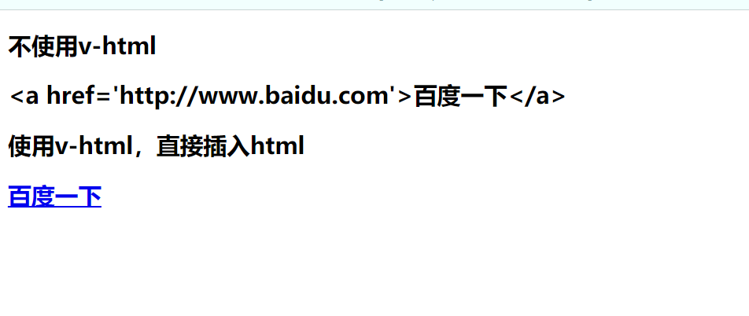
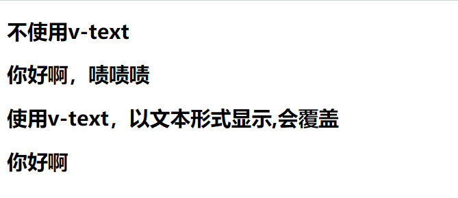

# （三）插值操作

## 3.1 Mustache 语法

​ mustache 是胡须的意思，因为`{{}}`像胡须，又叫大括号语法。

​ 在 vue 对象挂载的 dom 元素中，`{{}}`不仅可以直接写变量，还可以写简单表达式。

```html
<!DOCTYPE html>
<html lang="en">
	<head>
		<meta charset="UTF-8" />
		<meta name="viewport" content="width=device-width, initial-scale=1.0" />
		<meta http-equiv="X-UA-Compatible" content="ie=edge" />
		<title>Mustache的语法</title>
	</head>
	<body>
		<div id="app">
			<h2>{{message}}</h2>
			<h2>{{message}},啧啧啧</h2>

			<!-- Mustache的语法不仅可以直接写变量，还可以写简单表达式 -->
			<h2>{{firstName + lastName}}</h2>
			<h2>{{firstName + " " + lastName}}</h2>
			<h2>{{firstName}} {{lastName}}</h2>
			<h2>{{count * 2}}</h2>
		</div>
		<script src="https://cdn.jsdelivr.net/npm/vue@2.6.10/dist/vue.js"></script>
		<script>
			const app = new Vue({
				el: '#app',
				data: {
					message: '你好啊',
					firstName: 'skt t1',
					lastName: 'faker',
					count: 100,
				},
			});
		</script>
	</body>
</html>
```

## 3.2 v-once

​ v-once 表示该 dom 元素只渲染一次，之后数据改变，不会再次渲染。

```html
<div id="app">
	<h2>{{message}}</h2>
	<!-- 只会渲染一次，数据改变不会再次渲染 -->
	<h2 v-once>{{message}}</h2>
</div>
```

​ 上述`{{message}}`的 message 修改后，第一个 h2 标签数据会自动改变，第二个 h2 不会。

## 3.3 v-html

​ 在某些时候我们不希望直接输出`<a href='http://www.baidu.com'>百度一下</a>`这样的字符串，而输出被 html 自己转化的超链接。此时可以使用 v-html。

```html
<!DOCTYPE html>
<html lang="en">
	<head>
		<meta charset="UTF-8" />
		<meta name="viewport" content="width=device-width, initial-scale=1.0" />
		<meta http-equiv="X-UA-Compatible" content="ie=edge" />
		<title>v-html指令的使用</title>
	</head>
	<body>
		<div id="app">
			<h2>不使用v-html</h2>
			<h2>{{url}}</h2>
			<h2>使用v-html，直接插入html</h2>
			<h2 v-html="url"></h2>
		</div>
		<script src="https://cdn.jsdelivr.net/npm/vue@2.6.10/dist/vue.js"></script>
		<script>
			const app = new Vue({
				el: '#app',
				data: {
					message: '你好啊',
					url: "<a href='http://www.baidu.com'>百度一下</a>",
				},
			});
		</script>
	</body>
</html>
```

输出结果如下：



## 3.4 v-text

​ v-text 会覆盖 dom 元素中的数据，相当于 js 的 innerHTML 方法。

```html
<!DOCTYPE html>
<html lang="en">
	<head>
		<meta charset="UTF-8" />
		<meta name="viewport" content="width=device-width, initial-scale=1.0" />
		<meta http-equiv="X-UA-Compatible" content="ie=edge" />
		<title>v-text指令的使用</title>
	</head>
	<body>
		<div id="app">
			<h2>不使用v-text</h2>
			<h2>{{message}}，啧啧啧</h2>
			<h2>使用v-text，以文本形式显示,会覆盖</h2>
			<h2 v-text="message">，啧啧啧</h2>
		</div>
		<script src="https://cdn.jsdelivr.net/npm/vue@2.6.10/dist/vue.js"></script>
		<script>
			const app = new Vue({
				el: '#app',
				data: {
					message: '你好啊',
				},
			});
		</script>
	</body>
</html>
```

​ 如图所示，使用`{{message}}`是拼接变量和字符串，而是用 v-text 是直接覆盖字符串内容。



## 3.5 v-pre

​ 有时候我们期望直接输出`{{message}}`这样的字符串，而不是被`{{}}`语法转化的 message 的变量值，此时我们可以使用`v-pre`标签。

```html
<!DOCTYPE html>
<html lang="en">
	<head>
		<meta charset="UTF-8" />
		<meta name="viewport" content="width=device-width, initial-scale=1.0" />
		<meta http-equiv="X-UA-Compatible" content="ie=edge" />
		<title>v-pre指令的使用</title>
	</head>
	<body>
		<div id="app">
			<h2>不使用v-pre</h2>
			<h2>{{message}}</h2>
			<h2>使用v-pre,不会解析</h2>
			<h2 v-pre>{{message}}</h2>
		</div>
		<script src="https://cdn.jsdelivr.net/npm/vue@2.6.10/dist/vue.js"></script>
		<script>
			const app = new Vue({
				el: '#app',
				data: {
					message: '你好啊',
				},
			});
		</script>
	</body>
</html>
```

​ 结果如图，使用 v-pre 修饰的 dom 会直接输出字符串。


## 3.6 v-cloak

​ 有时候因为加载延时问题，例如卡掉了，数据没有及时刷新，就造成了页面显示从`{{message}}`到 message 变量“你好啊”的变化，这样闪动的变化，会造成用户体验不好。此时需要使用到`v-cloak`的这个标签。在 vue 解析之前，div 属性中有`v-cloak`这个标签，在 vue 解析完成之后，v-cloak 标签被移除。简单，类似 div 开始有一个 css 属性`display:none;`，加载完成之后，css 属性变成`display:block`，元素显示出来。

```html
<!DOCTYPE html>
<html lang="en">
	<head>
		<meta charset="UTF-8" />
		<meta name="viewport" content="width=device-width, initial-scale=1.0" />
		<meta http-equiv="X-UA-Compatible" content="ie=edge" />
		<title>v-cloak指令的使用</title>
		<style>
			[v-cloak] {
				display: none;
			}
		</style>
	</head>

	<body>
		<div id="app" v-cloak>
			<h2>{{message}}</h2>
		</div>
		<script src="https://cdn.jsdelivr.net/npm/vue@2.6.10/dist/vue.js"></script>
		<script>
			//在vue解析前，div中有一个属性cloak
			//在vue解析之后，div中没有一个属性v-cloak
			setTimeout(() => {
				const app = new Vue({
					el: '#app',
					data: {
						message: '你好啊',
					},
				});
			}, 1000);
		</script>
	</body>
</html>
```

​ 这里通过延时 1 秒模拟加载卡住的状态，结果一开始不显示 message 的值，div 元素中有 v-cloak 的属性，1 秒后显示 message 变量的值，div 中的 v-cloak 元素被移除。


