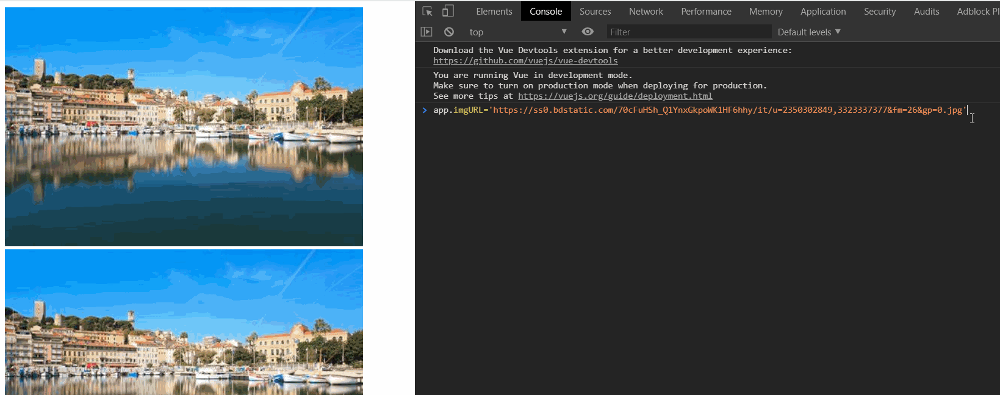
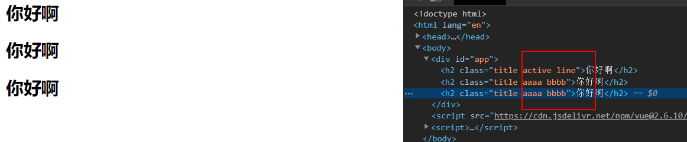
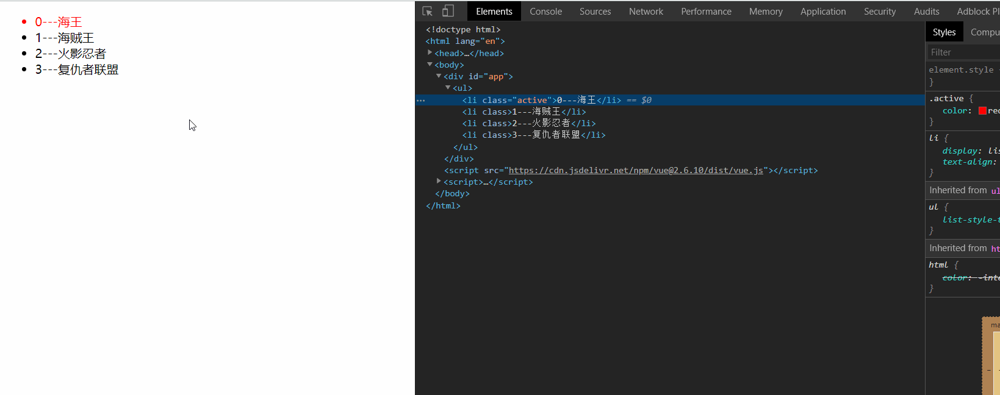

# （四）动态绑定属性

## 4.1 v-bind 的基本使用

​ 某些时候我们并不想将变量放在标签内容中，像这样`<h2>{{message}}</h2>`是将变量 h2 标签括起来，类似 js 的 innerHTML。但是我们期望将变量`imgURL`写在如下位置，想这样``导入图片是希望动态获取图片的链接，此时的 imgURL 并非变量而是字符串 imgURL，如果要将其生效为变量，需要使用到一个标签`v-bind:`，像这样``，而且这里也不能使用 Mustache 语法，类似``，这也是错误的。

```html
<!DOCTYPE html>
<html lang="en">
	<head>
		<meta charset="UTF-8" />
		<meta name="viewport" content="width=device-width, initial-scale=1.0" />
		<meta http-equiv="X-UA-Compatible" content="ie=edge" />
		<title>v-bind的基本使用</title>
	</head>
	<body>
		<div id="app">
			<!-- 错误的做法这里不能使用Mustache语法 -->
			<!--  -->
			<!-- 正确的做法使用v-bind指令 -->
			
			<a v-bind:href="aHerf"></a>
			<!-- 语法糖写法 -->
			
			<a :href="aHerf"></a>
		</div>
		<script src="https://cdn.jsdelivr.net/npm/vue@2.6.10/dist/vue.js"></script>
		<script>
			const app = new Vue({
				el: '#app',
				data: {
					message: '你好啊',
					imgURL:
						'https://cn.bing.com/th?id=OIP.NaSKiHPRcquisK2EehUI3gHaE8&pid=Api&rs=1',
					aHerf: 'http://www.baidu.com',
				},
			});
		</script>
	</body>
</html>
```

​ 此时 vue 对象中定义的`imgURL`变量和`aHerf`变量可以动态的绑定到 img 标签的 src 属性和 a 标签的 href 属性。`v-bind:`由于用的很多，vue 对他有一个语法糖的优化写法也就是`:`，此时修改 imgURL 变量图片叶重新加载。



## 4.2 v-bind 动态绑定 class(对象语法)

​ 有时候我们期望对 Dom 元素的节点的 class 进行动态绑定，选择此 Dom 是否有指定 class 属性。例如，给 h2 标签加上`class="active"`，当 Dom 元素有次 class 时候，变红`<style>.active{color:red;}</style>`，在写一个按钮绑定事件，点击变黑色，再次点击变红色。

```html
<!DOCTYPE html>
<html lang="en">
	<head>
		<meta charset="UTF-8" />
		<meta name="viewport" content="width=device-width, initial-scale=1.0" />
		<meta http-equiv="X-UA-Compatible" content="ie=edge" />
		<title>v-bind动态绑定class(对象语法)</title>
		<style>
			.active {
				color: red;
			}
		</style>
	</head>
	<body>
		<div id="app">
			<!-- <h2 class="active">{{message}}</h2>
    <h2 :class="active">{{message}}</h2> -->

			<!-- 动态绑定class对象用法  -->
			<!-- <h2 :class="{key1:value1,key2:value2}">{{message}}</h2>
    <h2 :class="{类名1:true,类名2:boolean}">{{message}}</h2> -->
			<h2 class="title" :class="{active:isActive}">{{message}}</h2>
			<h2 class="title" :class="getClasses()">{{message}}</h2>
			<button @click="change">点击变色</button>
		</div>
		<script src="https://cdn.jsdelivr.net/npm/vue@2.6.10/dist/vue.js"></script>
		<script>
			const app = new Vue({
				el: '#app',
				data: {
					message: '你好啊',
					active: 'active',
					isActive: true,
				},
				methods: {
					change() {
						this.isActive = !this.isActive;
					},
					getClasses() {
						return { active: this.isActive };
					},
				},
			});
		</script>
	</body>
</html>
```

​ 定义两个变量`active`和`isActive`，在 Dom 元素中使用`:class={active:isActive}`，此时绑定的`class='active'`，isActive 为 true，active 显示，定义方法 change()绑定在按钮上，点击按钮`this.isActive = !this.isActive`，控制 Dom 元素是否有`class='active'`的属性。

## 4.3 v-bind 动态绑定 class(数组用法)

​ class 属性中可以放数组，会依次解析成对应的 class。

```html
<!DOCTYPE html>
<html lang="en">
	<head>
		<meta charset="UTF-8" />
		<meta name="viewport" content="width=device-width, initial-scale=1.0" />
		<meta http-equiv="X-UA-Compatible" content="ie=edge" />
		<title>v-bind动态绑定class(数组用法)</title>
		<style></style>
	</head>
	<body>
		<div id="app">
			<!-- 加上单引号当成字符串 -->
			<h2 class="title" :class="['active','line']">{{message}}</h2>
			<!-- 不加会被当成变量 -->
			<h2 class="title" :class="[active,line]">{{message}}</h2>
			<h2 class="title" :class="getClasses()">{{message}}</h2>
		</div>
		<script src="https://cdn.jsdelivr.net/npm/vue@2.6.10/dist/vue.js"></script>
		<script>
			const app = new Vue({
				el: '#app',
				data: {
					message: '你好啊',
					active: 'aaaa',
					line: 'bbbb',
				},
				methods: {
					getClasses() {
						return [this.active, this.line];
					},
				},
			});
		</script>
	</body>
</html>
```

1. ​ 加上单引号的表示字符串

2. ​ 不加的会当成变量

3. ​ 可以直接使用方法返回数组对象

    

## 4.4 v-for 和 v-bind 结合

​ 使用 v-for 和 v-bind 实现一个小 demo，将电影列表展示，并点击某一个电影列表时候，将此电影列表变成红色。

```html
<!DOCTYPE html>
<html lang="en">
	<head>
		<meta charset="UTF-8" />
		<meta name="viewport" content="width=device-width, initial-scale=1.0" />
		<meta http-equiv="X-UA-Compatible" content="ie=edge" />
		<title>作业(v-for和v-bind的结合)</title>
		<style>
			.active {
				color: red;
			}
		</style>
	</head>
	<body>
		<div id="app">
			<ul>
				<li
					v-for="(item, index) in movies"
					:key="index"
					:class="{active:index===currentIndex}"
					@click="changeColor(index)"
				>
					{{index+"---"+item}}
				</li>
			</ul>
		</div>
		<script src="https://cdn.jsdelivr.net/npm/vue@2.6.10/dist/vue.js"></script>
		<script>
			const app = new Vue({
				el: '#app',
				data: {
					currentIndex: 0,
					movies: ['海王', '海贼王', '火影忍者', '复仇者联盟'],
				},
				methods: {
					changeColor(index) {
						this.currentIndex = index;
					},
				},
			});
		</script>
	</body>
</html>
```

​ v-for 时候的 index 索引，给每行绑定事件点击事件，点击当行是获取此行索引 index 并赋值给`currentIndex`，使用`v-bind:`绑定 class，当`index===currentIndex`Dom 元素有 active 的 class，颜色变红。



## 4.5 v-bind 动态绑定 style

### 4.5.1 v-bind 动态绑定 style(对象语法)

```html
<!-- <h2 :style="{key(属性名):value(属性值)}">{{message}}</h2> -->
<!-- 加单引号，当成字符串解析 -->
<h2 :style="{fontSize:'50px'}">{{message}}</h2>
<!-- 不加单引号，变量解析 -->
<h2 :style="{fontSize:fontSize}">{{message}}</h2>
<h2 :style="getStyle()">{{message}}</h2>
```

### 4.5.2 v-bind 动态绑定 style(数组语法)

```html
<div id="app">
	<h2 :style="[baseStyle]">{{message}}</h2>
	<h2 :style="getStyle()">{{message}}</h2>
</div>
<script src="https://cdn.jsdelivr.net/npm/vue@2.6.10/dist/vue.js"></script>
<script>
	const app = new Vue({
		el: '#app',
		data: {
			message: '你好啊',
			baseStyle: { backgroundColor: 'red' },
		},
		methods: {
			getStyle() {
				return [this.baseStyle];
			},
		},
	});
</script>
```

​ 类似绑定 class，绑定 style 也是一样的。
