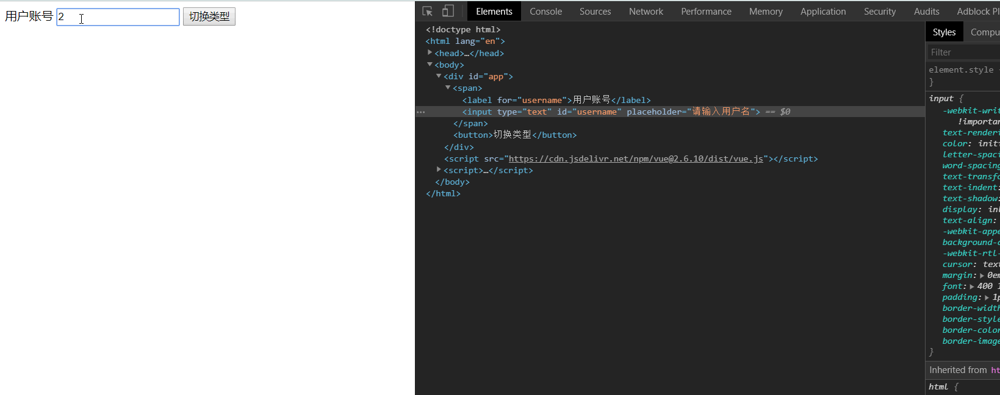

# （七）条件判断

## 7.1 v-if、v-eles、v-else-if

​ v-if 用于条件判断，判断 Dom 元素是否显示。

```html
<!DOCTYPE html>
<html lang="en">
	<head>
		<meta charset="UTF-8" />
		<meta name="viewport" content="width=device-width, initial-scale=1.0" />
		<meta http-equiv="X-UA-Compatible" content="ie=edge" />
		<title>Document</title>
	</head>
	<body>
		<div id="app">
			<h2 v-if="isFlag">isFlag为true显示这个</h2>
			<h2 v-show="isShow">isShow为true是显示这个</h2>
			<div v-if="age<18">小于18岁未成年</div>
			<div v-else-if="age<60">大于18岁小于60岁正值壮年</div>
			<div v-else="">大于60岁,暮年</div>
		</div>
		<script src="https://cdn.jsdelivr.net/npm/vue@2.6.10/dist/vue.js"></script>
		<script>
			const app = new Vue({
				el: '#app',
				data: {
					isFlag: true,
					isShow: false,
					age: 66,
				},
			});
		</script>
	</body>
</html>
```

1. 单独使用 v-if，变量为布尔值，为 true 才渲染 Dom

2. v-show 的变量也是布尔值，为 true 才显示内容，类似 css 的 display

3. v-if、v-else、v-else-if 联合使用相当于 if、elseif、else，但是在条件比较多的时候建议使用计算属性。

    

## 7.2 v-if 的 demo

​ 在登录网站是经常可以选择使用账户名或者邮箱登录的切换按钮。要求点击按钮切换登录方式。

```html
<!DOCTYPE html>
<html lang="en">
	<head>
		<meta charset="UTF-8" />
		<meta name="viewport" content="width=device-width, initial-scale=1.0" />
		<meta http-equiv="X-UA-Compatible" content="ie=edge" />
		<title>Document</title>
	</head>
	<body>
		<div id="app">
			<span v-if="isUser">
				<label for="username">用户账号</label>
				<input type="text" id="username" placeholder="请输入用户名" />
			</span>
			<span v-else="isUser">
				<label for="email">用户邮箱</label>
				<input type="text" id="email" placeholder="请输入用户邮箱" />
			</span>
			<button @click="isUser=!isUser">切换类型</button>
		</div>
		<script src="https://cdn.jsdelivr.net/npm/vue@2.6.10/dist/vue.js"></script>
		<script>
			const app = new Vue({
				el: '#app',
				data: {
					isUser: true,
				},
			});
		</script>
	</body>
</html>
```

​ 使用`v-if`和`v-else`选择渲染指定的 Dom，点击按钮对`isUser`变量取反。

> 这里有个小问题，如果已经输入了账号了，此时想切换到邮箱输入，输入框未自己清空。



​ 这里需要了解一下 vue 底层操作，此时 input 输入框值被复用了。

1. vue 在进行 DOM 渲染是，处于性能考虑，会复用已经存在的元素，而不是每次都创建新的 DOM 元素。

2. 在上面 demo 中，Vue 内部发现原来的 input 元素不再使用，所以直接将其映射对应虚拟 DOM，用来复用。

3. 如果不希望出现类似复用问题，可以给对应的 dom 元素加上`key`值，并保证`key`不同。

    ```html
    <input
    	type="text"
    	id="username"
    	placeholder="请输入用户名"
    	key="username"
    />
    <input type="text" id="email" placeholder="请输入用户邮箱" key="email" />
    ```

## 7.3 v-show

​ v-if 看似和 v-show 实现一样的效果，但是内部 v-show 只是用 css 将操作的元素隐藏显示，而 v-if 是新增和删除元素。v-show 只是操作元素的 style 属性 display，都没会被创建。当需要在现实与隐藏之间切换很频繁的时候，使用 v-show，当只有一次切换时，使用 v-if。

```html
<!DOCTYPE html>
<html lang="en">
	<head>
		<meta charset="UTF-8" />
		<meta name="viewport" content="width=device-width, initial-scale=1.0" />
		<meta http-equiv="X-UA-Compatible" content="ie=edge" />
		<title>Document</title>
	</head>
	<body>
		<div id="app">
			<h2 v-show="isFlag">
				v-show只是操作元素的style属性display，都没会被创建
			</h2>
			<h2 v-if="isFlag">v-if是新增和删除dom元素</h2>
		</div>
		<script src="https://cdn.jsdelivr.net/npm/vue@2.6.10/dist/vue.js"></script>
		<script>
			const app = new Vue({
				el: '#app',
				data: {
					isFlag: true,
				},
			});
		</script>
	</body>
</html>
```
