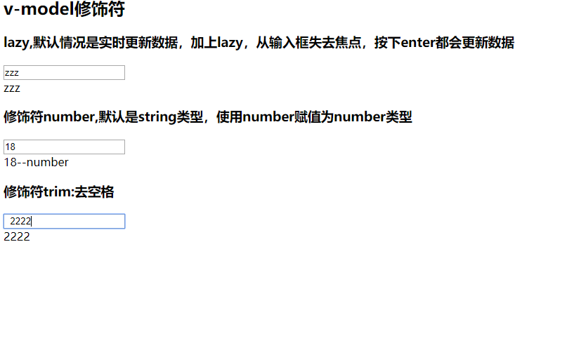

# （十）v-model

## 10.1	v-model的基本使用

```html
  <div id="app">
    <!-- 输入框内容修改，message也修改，修改message，input内容也修改，双向绑定 -->
    <input type="text" v-model="message">{{message}}
  </div>
  <script src="https://cdn.jsdelivr.net/npm/vue@2.6.10/dist/vue.js"></script>
  <script>
    const app = new Vue({
      el:"#app",
      data:{
        message:"zzz"
      }
    })
  </script>
```

​	v-model双向绑定，既输入框的value改变，对应的message对象值也会改变，修改message的值，input的value也会随之改变。无论改变那个值，另外一个值都会变化。

## 10.2	v-model的原理

​	先来一个demo实现不使用v-model实现双向绑定。

```html
  <div id="app">
    <!-- v-model = v-bind + v-on -->
    <!-- 输入框内容修改，message也修改，修改message，input内容也修改，双向绑定 -->
    <!-- <input type="text" v-model="message"> -->
    <!-- 实现双向绑定 @input监听输入框事件  -->
    <!-- <input type="text" :value="message" @input="valueChange" > -->
    <!-- $event获取事件对象，$event.target.value获取input值 -->
    <input type="text" :value="message" @input="valueChange($event.target.value)">

    {{message}}
  </div>
  <script src="https://cdn.jsdelivr.net/npm/vue@2.6.10/dist/vue.js"></script>
  <script>
    const app = new Vue({
      el:"#app",
      data:{
        message:"zzz"
      },
      methods:{
        // valueChange(event){
        //   console.log("input值改变了");
        //   this.message = event.target.value
        // },
        valueChange(value){
          console.log("input值改变了");
          this.message = value
        }
      }
    })
  </script>
```

​	`v-model = v-bind + v-on`，实现双向绑定需要是用v-bind和v-on，使用v-bind给input的value绑定message对象，此时message对象改变，input的值也会改变。但是改变input的value并不会改变message的值，此时需要一个v-on绑定一个方法，监听事件，当input的值改变的时候，将最新的值赋值给message对象。`$event`获取事件对象，target获取监听的对象dom，value获取最新的值。

## 10.3	v-model结合radio类型使用

​	radio单选框的`name`属性是互斥的，如果使用v-model，可以不使用`name`就可以互斥。

```html
  <div id="app">
    <!-- name属性radio互斥 使用v-model可以不用name就可以互斥 -->
    <label for="male">
      <input type="radio" id="male" name="sex" value="男" v-model="sex">男
    </label>
    <label for="female">
        <input type="radio" id="female" name="sex" value="女" v-model="sex">女
    </label>
    <div>你选择的性别是：{{sex}}</div>

  </div>
  <script src="https://cdn.jsdelivr.net/npm/vue@2.6.10/dist/vue.js"></script>
  <script>
    const app = new Vue({
      el:"#app",
      data:{
        message:"zzz",
        sex:"男"
      },

    })
  </script>
```

 	v-model绑定`sex`属性，初始值为“男”，选择女后`sex`属性变成“女”，因为此时是双向绑定。

## 10.4	v-model结合checkbox类型

​	checkbox可以结合v-model做单选框，也可以多选框。

```html
<!DOCTYPE html>
<html lang="en">
<head>
  <meta charset="UTF-8">
  <meta name="viewport" content="width=device-width, initial-scale=1.0">
  <meta http-equiv="X-UA-Compatible" content="ie=edge">
  <title>v-model结合checkbox类型</title>
</head>
<body>
  <div id="app">
    <!-- checkbox单选框 -->
    <h2>单选框</h2>
    <label for="agree">
      <input type="checkbox" id="agree" v-model="isAgree">同意协议
    </label>

    <div>你选择的结果是：{{isAgree}}</div>

    <button :disabled="!isAgree">下一步</button>
    <!-- checkbox多选框 -->
    <h2>多选框</h2>

      <label :for="item" v-for="(item, index) in oriHobbies" :key="index">
        <input type="checkbox" name="hobby" :value="item" :id="item" v-model="hobbies">{{item}}
      </label>
      <!-- <input type="checkbox" name="hobby" value="篮球" v-model="hobbies">篮球
      <input type="checkbox" name="hobby" value="足球" v-model="hobbies">足球
      <input type="checkbox" name="hobby" value="羽毛球"  v-model="hobbies">羽毛球
      <input type="checkbox" name="hobby" value="乒乓球"  v-model="hobbies">乒乓球 -->

    <div>你的爱好是：{{hobbies}}</div>

  </div>
  <script src="https://cdn.jsdelivr.net/npm/vue@2.6.10/dist/vue.js"></script>
  <script>
    const app = new Vue({
      el:"#app",
      data:{
        message:"zzz",
        isAgree:false,
        hobbies:[],
        oriHobbies:["篮球","足球","羽毛球","乒乓球"]
      },

    })
  </script>
</body>
</html>
```

1. checkbox结合v-model实现单选框，定义变量`isAgree`初始化为`false`，点击checkbox的值为`true`，`isAgree`也是`true`。
2. checkbox结合v-model实现多选框，定义数组对象`hobbies`，用于存放爱好，将`hobbies`与checkbox对象双向绑定，此时选中，一个多选框，就多一个true，`hobbies`就添加一个对象。


## 10.5	v-model结合select类型

```html
<!DOCTYPE html>
<html lang="en">
<head>
  <meta charset="UTF-8">
  <meta name="viewport" content="width=device-width, initial-scale=1.0">
  <meta http-equiv="X-UA-Compatible" content="ie=edge">
  <title>v-model结合select类型</title>
</head>
<body>
  <div id="app">
    <!-- select单选 -->
    <select name="fruit" v-model="fruit">
      <option value="苹果">苹果</option>
      <option value="香蕉">香蕉</option>
      <option value="西瓜">西瓜</option>
    </select>
    <h2>你选择的水果是：{{fruit}}</h2>

    <!-- select多选 -->
    <select name="fruits" v-model="fruits" multiple>
      <option value="苹果">苹果</option>
      <option value="香蕉">香蕉</option>
      <option value="西瓜">西瓜</option>
    </select>
    <h2>你选择的水果是：{{fruits}}</h2>
  </div>
  <script src="https://cdn.jsdelivr.net/npm/vue@2.6.10/dist/vue.js"></script>
  <script>
    const app = new Vue({
      el:"#app",
      data:{
        fruit:"苹果",
        fruits:[]
      },

    })
  </script>
</body>
```

​	v-model结合select可以单选也可以多选。

## 10.6	v-model的修饰符的使用

### 	10.6.1	lazy

```html
<!DOCTYPE html>
<html lang="en">
<head>
  <meta charset="UTF-8">
  <meta name="viewport" content="width=device-width, initial-scale=1.0">
  <meta http-equiv="X-UA-Compatible" content="ie=edge">
  <title>v-model修饰符</title>
</head>
<body>
  <div id="app">
    <h2>v-model修饰符</h2>
    <h3>lazy,默认情况是实时更新数据，加上lazy，从输入框失去焦点，按下enter都会更新数据</h3>
    <input type="text" v-model.lazy="message">
    <div>{{message}}</div>
    <h3>修饰符number,默认是string类型，使用number赋值为number类型</h3>
    <input type="number" v-model.number="age">
    <div>{{age}}--{{typeof age}}</div>
    <h3>修饰符trim:去空格</h3>
    <input type="text" v-model.trim="name">

  </div>
  <script src="https://cdn.jsdelivr.net/npm/vue@2.6.10/dist/vue.js"></script>
  <script>
    const app = new Vue({
      el:"#app",
      data:{
        message:"zzz",
        age:18,
        name:"ttt"
      },

    })
  </script>
</body>
</html>
```

1. `lazy`默认情况下是实时更新数据，加上`lazy`，从输入框失去焦点，按下enter都会更新数据。
2. `number`,默认是string类型，使用`number`复制为number类型。
3. `trim`用于 自动过滤用户输入的首尾空白字符 




