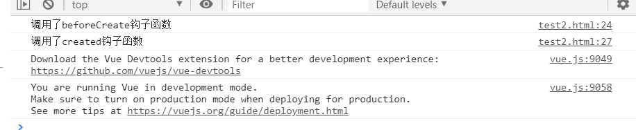
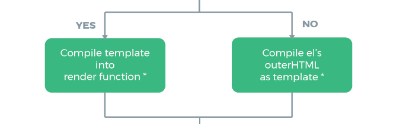
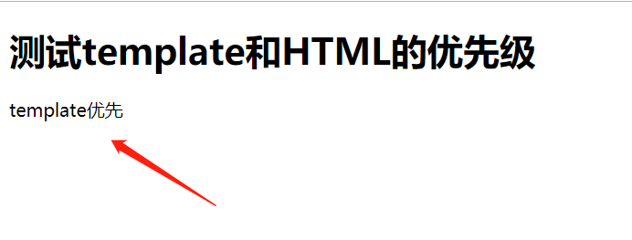
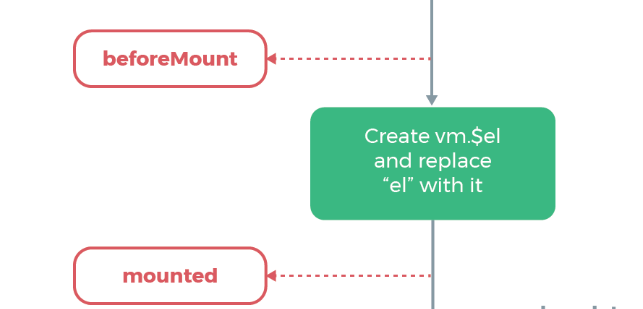
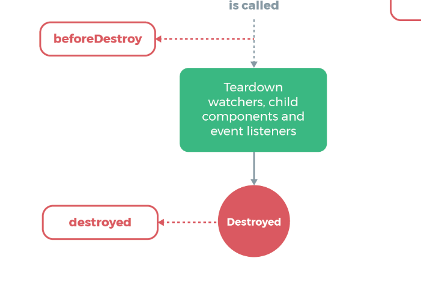

# （十三）Vue 实例的生命周期

## 13.1 <span id="top">生命周期图</span>

​ Vue 实例的生命周期中有多个状态。


> 测试代码

```html
<!DOCTYPE html>
<html lang="en">
	<head>
		<meta charset="UTF-8" />
		<meta name="viewport" content="width=device-width, initial-scale=1.0" />
		<meta http-equiv="X-UA-Compatible" content="ie=edge" />
		<title>Vue实例的生命周期</title>

		<!-- 引入vue.js -->
		<script src="https://cdn.jsdelivr.net/npm/vue@2.6.10/dist/vue.js"></script>
	</head>
	<body>
		<div id="app">
			<h1>测试生命周期</h1>
			<div>{{msg}}</div>
			<hr />
			<h3>测试beforeUpdate和update两个钩子函数</h3>
			<button @click="handlerUpdate">更新数据</button>
		</div>
		<script>
			var app = new Vue({
				el: '#app',
				data: {
					msg: '12345',
				},
				methods: {
					handlerUpdate: function () {
						this.msg = this.msg.split('').reverse().join('');
					},
				}, //按照示意图依次调用
				beforeCreate: function () {
					console.log('调用了beforeCreate钩子函数');
				},
				created: function () {
					console.log('调用了created钩子函数');
				},
				beforeMount: function () {
					console.log('调用了beforeMount钩子函数');
				},
				mounted: function () {
					console.log('调用了mounted钩子函数');
				},
				beforeUpdate: function () {
					console.log('调用了beforeUpdate钩子函数');
				},
				updated: function () {
					console.log('调用了updated钩子函数');
				},
				beforeDestroy: function () {
					console.log('调用了beforeDestroy钩子函数');
				},
				destroyed: function () {
					console.log('调用了destroyed钩子函数');
				},
			});
		</script>
	</body>
</html>
```

如图所示：


初始化页面依次调用了：

> 1. 调用了 beforeCreate 钩子函数
> 2. 调用了 created 钩子函数
> 3. 调用了 beforeMount 钩子函数
> 4. 调用了 mounted 钩子函数

点击更新数据后：

`12345`变成了`54321`，此时调用了：

> 1. 调用了 beforeUpdate 钩子函数
> 2. 调用了 updated 钩子函数

打开 F12 控制台
直接输入`app.$destroy()`主动销毁 Vue 实例调用：

> 1.  调用了 beforeDestroy 钩子函数
> 2.  调用了 destroyed 钩子函数

## 13.2 再探究

### 13.2.1 beforeCreate 之前

初始化钩子函数和生命周期

### 13.2.2 beforeCreate 和 created 钩子函数间的生命周期

在 beforeCreate 和 created 之间，进行数据观测(data observer) ，也就是在这个时候开始监控 data 中的数据变化了，同时初始化事件。
<span style="float:right;">[生命周期展示图](#1)</span>

### 13.2.3 created 钩子函数和 beforeMount 间的生命周期

对于 created 钩子函数和 beforeMount 有判断：


#### 13.2.3.1el 选项对生命周期影响

> 1.  有 el 选项

    new Vue({
        el: '#app',
        beforeCreate: function () {
            console.log('调用了beforeCreat钩子函数')
        },
        created: function () {
            console.log('调用了created钩子函数')
        },
        beforeMount: function () {
            console.log('调用了beforeMount钩子函数')
        },
        mounted: function () {
            console.log('调用了mounted钩子函数')
        }
    })

结果:


> 2.  无 el 选项

    new Vue({
        beforeCreate: function () {
            console.log('调用了beforeCreat钩子函数')
        },
        created: function () {
            console.log('调用了created钩子函数')
        },
        beforeMount: function () {
            console.log('调用了beforeMount钩子函数')
        },
        mounted: function () {
            console.log('调用了mounted钩子函数')
        }
    })

结果：


> 证明没有 el 选项，则停止编译，也意味着暂时停止了生命周期。生命周期到 created 钩子函数就结束了。而当我们不加 el 选项，但是手动执行 vm.\$mount(el)方法的话，也能够使暂停的生命周期进行下去，例如：

    var app = new Vue({
        beforeCreate: function () {
            console.log('调用了beforeCreat钩子函数')
        },
        created: function () {
            console.log('调用了created钩子函数')
        },
        beforeMount: function () {
            console.log('调用了beforeMount钩子函数')
        },
        mounted: function () {
            console.log('调用了mounted钩子函数')
        }
    })
    app.$mount('#app')

结果：


#### 13.2.3.2 template



> 同时使用`template`和`HTML`，查看优先级：

        <h1>测试template和HTML的优先级</h1>
        <div id="app">
            <p>HTML优先</p>
        </div>
        <script>
            var app = new Vue({
                el:"#app",
                data:{
                    msg:"template优先"
                },
                template:"<p>{{msg}}</p>",
            });
        </script>

结果：


> 结论

1. 如果 Vue 实例对象中有 template 参数选项，则将其作为模板编译成 render 函数
2. 如果没有 template 参数选项，则将外部的 HTML 作为模板编译（template），也就是说，template 参数选项的优先级要比外部的 HTML 高
3. 如果 1,2 条件都不具备，则报错

> 注意

1. Vue 需要通过 el 去找对应的 template，Vue 实例通过 el 的参数，首先找自己有没有 template，如果没有再去找外部的 html，找到后将其编译成 render 函数。
2. 也可以直接调用[render](https://cn.vuejs.org/v2/api/#render)选项，优先级：`render函数选项 > template参数 > 外部HTML`。

<hr>

    new Vue({
        el: '#app',
        render (createElement) {
            return (....)
        }
    })

### 13.2.4 beforeMount 和 mounted 钩子函数间的生命周期



> beforeMount

载入前（完成了 data 和 el 数据初始化），但是页面中的内容还是 vue 中的占位符，data 中的 message 信息没有被挂在到 Dom 节点中，在这里可以在渲染前最后一次更改数据的机会，不会触发其他的钩子函数，一般可以在这里做初始数据的获取。

> Mount

载入后 html 已经渲染(ajax 请求可以放在这个函数中)，把 vue 实例中的 data 里的 message 挂载到 DOM 节点中去

> 这里两个钩子函数间是载入数据。

### 13.2.5 beforeUpdate 钩子函数和 updated 钩子函数间的生命周期


在 Vue 中，修改数据会导致重新渲染，依次调用 beforeUpdate 钩子函数和 updated 钩子函数

如果待修改的数据没有载入模板中，不会调用这里两个钩子函数

    var app = new Vue({
        el: '#app',
        data: {
            msg: 1
        },
        template: '<div id="app"><p></p></div>',
        beforeUpdate: function () {
            console.log('调用了beforeUpdate钩子函数')
        },
        updated: function () {
            console.log('调用了updated钩子函数')
        }
    })
    app.msg = 2

结果：

如果绑定了数据，会调用两个钩子函数：

    <h1>测试有数据绑定修改数据，钩子函数调用情况</h1>
    <div id="app">
    </div>
    <script>
        var app = new Vue({
            el:"#app",
            template:"<p>{{msg}}</p>",
            data:{
                msg:"原数据"
            },
            beforeUpdate: function () {
                console.log("调用了beforeUpdate钩子函数")
            },
            updated: function () {
                console.log("调用了updated钩子函数");
            },
        });
        app.msg = "数据被修改了";
    </script>

结果：


> 注意只有写入模板的数据才会被追踪

### 13.2.6 beforeDestroy 和 destroyed 钩子函数间的生命周期



#### 13.2.6.1 beforeDestroy

销毁前执行（\$destroy 方法被调用的时候就会执行）,一般在这里善后:清除计时器、清除非指令绑定的事件等等…’)

#### 13.2.6.2 destroyed

销毁后 （Dom 元素存在，只是不再受 vue 控制）,卸载 watcher，事件监听，子组件

> 总结

-   beforecreate : 可以在这加个 loading 事件
-   created ：在这结束 loading，还做一些初始数据的获取，实现函数自-执行
-   mounted ： 在这发起后端请求，拿回数据，配合路由钩子做一些事情
-   beforeDestroy： 你确认删除 XX 吗？
-   destroyed ：当前组件已被删除，清空相关内容

<hr>
<div>
  <span style="float:left;"><a href="#top">返回顶部</a></span><span style="float:right;"><a href="../README.md">返回首页</a></span>
</div>
