# （十五）webpack

## 15.1 webpack 起步

### 15.1.1 什么是 webpack

webpack 是一个 JavaScript 应用的静态模块打包工具。

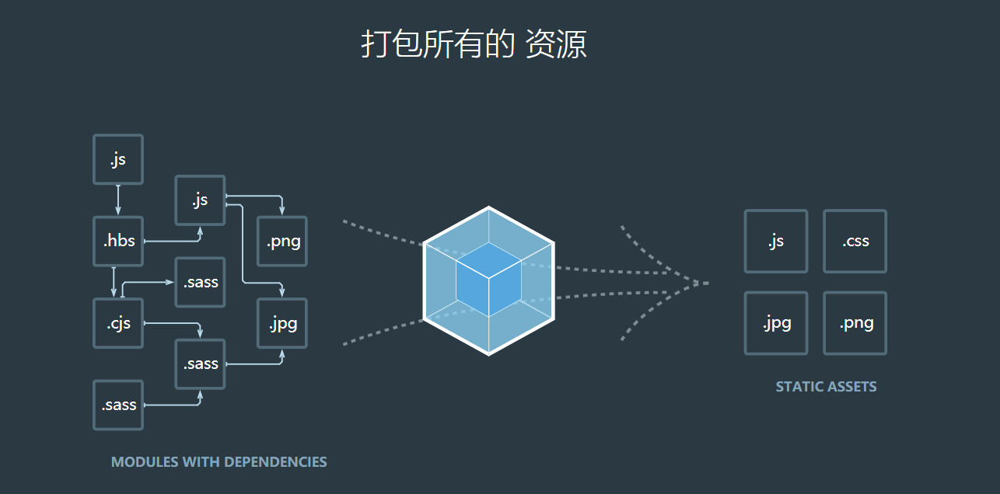

从这句话中有两个要点，**模块**和**打包**需要关注。**grunt/gulp**都可以打包，那有什么区别。

> 模块化

webpack 可以支持前端模块化的一些方案，例如 AMD、CMD、CommonJS、ES6。可以处理模块之间的依赖关系。不仅仅是 js 文件可以模块化，图片、css、json 文件等等都可以模块化。

> 打包

webpack 可以将模块资源打包成一个或者多个包，并且在打包过程中可以处理资源，例如压缩图片，将 scss 转成 css，ES6 语法转成 ES5 语法，将 TypeScript 转成 JavaScript 等等操作。**grunt/gulp**也可以打包。

**和 grunt/glup 的对比**

-   grunt/glup 的核心是 Task
    -   我们可以配置一系列的 task，并且定义 task 要处理的事务（例如 ES6/TS 转化，图片压缩，scss 转 css）
    -   之后可以让 grunt/glup 来执行依次这些任务，让整个流程自动化
    -   所以 grunt/glup 也被称为前端自动化任务管理工具
-   看一个 gulp 例子
    -   task 将 src 下的 js 文件转化为 ES5 语法
    -   并输入到 dist 文件夹中

<pre>const gulp = require('gulp')
    const babel = require('gulp-babel')
    gulp.task('js'()=>
      gulp.src('src/*.js')
        .pipe(babel({
          presets:['es2015']
        }))
        .pipe(gulp.dest('dist'))
    );
</pre>

-   什么时候使用 grunt/gulp 呢？
    -   如果工程依赖简单，甚至没有模块化
    -   只需要进行简单的合并/压缩
    -   如果模块复杂，相互依赖性强，我们需要使用 webpack
-   grunt/glup 和 webpack 区别
    -   grunt/glup 更加强调的是前端自动化流程，模块化不是其核心
    -   webpack 加强模块化开发管理，而文件压缩/合并/预处理等功能，是附带功能

webpack 就是前端模块化打包工具

### 15.1.2 webpack 的安装

1. webpack 依赖 node 环境。
2. node 环境依赖众多包，所以需要 npm，npm（node packages manager）node 包管理工具
3. nvm 是 node 管理工具可以自由切换 node 环境版本

**全局安装 webpack**

```shell
npm install webpack -g
//指定版本安装
npm install webpack@3.6.0 -g
```

> 由于 vue-cli2 基于 webpack3.6.0
> 如果要用 vue-cli2 的可以使用`npm install webpack@3.6.0 -g`

**局部安装**

```shell
npm install webpack --save-dev
```

-   在终端执行 webpack 命令，使用的是全局安装。

-   当在 package.json 中定义了 scripts 时，其中包括了 webpack 命令，那么使用的是局部 webpack

### 15.1.3 起步

新建一个文件夹，新建如下结构的目录：

**目录结构**

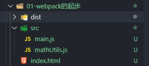

如图所示在 src 文件夹（源码文件夹），dist（要发布的文件，已经处理过的）。

**1.新建入口 js 文件`main.js`和`mathUtils.js`，`main.js`依赖`mathUtils.js`。**

> mathUtils

```javascript
//1.新建mathUtils.js，用CommonJs规范导出
function add(num1, num2) {
	return num1 + num2;
}
function mul(num1, num2) {
	return num1 * num2;
}
module.exports = {
	add,
	mul,
};
```

> main.js

```javascript
//2.新建入口js文件main.js 导入mathUtil.js文件，并调用
const { add, mul } = require('./mathUtils.js');

console.log(add(10, 20));
console.log(mul(10, 10));
```

**2.使用 webpack 命令打包 js 文件**

> 注意：webpack3 使用`webpack ./src/main.js ./dist/bundle.js`
>
> webpack4，webpack 打包在 01-webpack 的起步目录下打开终端 `webpack ./scr/main.js -o ./dist/bundle.js`

我全局安装的是webpack@3.6.0，所以在根路径执行

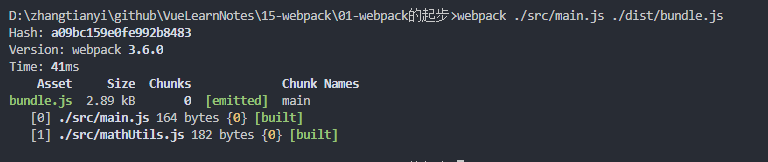

如图显示打包成功，查看 dist 文件夹下自动生成了一个`bundle.js`。

> bundle.js

```javascript
//2.新建入口js文件main.js 导入mathUtil.js文件，并调用
const {add,mul} = __webpack_require__(1)

console.log(add(10,20))
console.log(mul(10,10))

/***/ }),
/* 1 */
/***/ (function(module, exports) {

//1.新建mathUtils.js，用CommonJs规范导出
function add(num1,num2) {
  return num1+num2
}
function mul(num1,num2) {
  return num1*num2
}
module.exports = {
  add,mul
}

```

内容很多，其中包含 mathUtils.js 和 main.js 内容，打包成功。

**3.新建一个 index.html 文件，导入 bundle.js**

```html
<!DOCTYPE html>
<html lang="en">
	<head>
		<meta charset="UTF-8" />
		<meta name="viewport" content="width=device-width, initial-scale=1.0" />
		<meta http-equiv="X-UA-Compatible" content="ie=edge" />
		<title>webpack入门</title>
	</head>
	<body>
		<!-- 3.新建一个indexhtml文件并使用 webpack ./src/main.js ./dist/bundle.js webpack3使用此命令 -->
		<!-- 4.引用webpack打包后的js文件 -->
		<script src="./dist/bundle.js"></script>
	</body>
</html>
```

如图测试，打印成功。

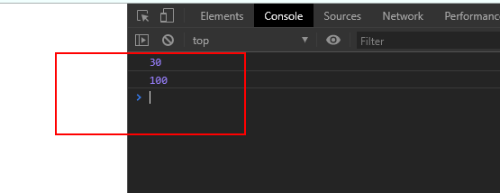

**4.新建一个`info.js`使用 ES6 的语法导出**

> info.js

```javascript
//es6语法导出
export default {
	name: 'zzz',
	age: 24,
};
```

> main.js 导入 info.js

```javascript
//使用es6语法导入
import info from './info.js';

console.log(info.name);
console.log(info.age);
```

> 再次使用`webpack ./src/main.js ./dist/bundle.js`，重新打包

**5.打开 index.html 测试**

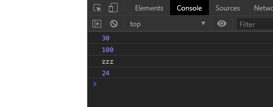

> 总结

webpack 可以帮我们打包 js 文件，只要指定入口文件（main.js）和输出的文件（bundle.js），不管是 es6 的模块化还是 CommonJs 的模块化，webpack 都可以帮我们打包，还可以帮我们处理模块之间的依赖。

## 15.2 webpack 的配置

### 15.2.1 基本配置

如果每次都用 webpack 命令自己写入口文件和出口文件会很麻烦，此时我们可以使用 webpack 的配置。

> 准备工作：复制**01-webpack 的起步**文件夹并粘贴在同级目录，改名为**02-webpack 的配置**。

**1.在根目录（02-webpack 的配置）下新建一个`webpack.config.js`**

> webpack.config.js

```javascript
//1.导入node的path包获取绝对路径，需要使用npm init初始化node包
const path = require('path');

//2.配置webpack的入口和出口
module.exports = {
	entry: './src/main.js', //入口文件
	output: {
		path: path.resolve(__dirname, 'dist'), //动态获取打包后的文件路径,path.resolve拼接路径
		filename: 'bundle.js', //打包后的文件名
	},
};
```

**2.在 02-webpack 的配置根目录执行`npm init`初始化 node 包，因为配置文件中用到了 node 的 path 包**

```shell
npm init
```

初始化

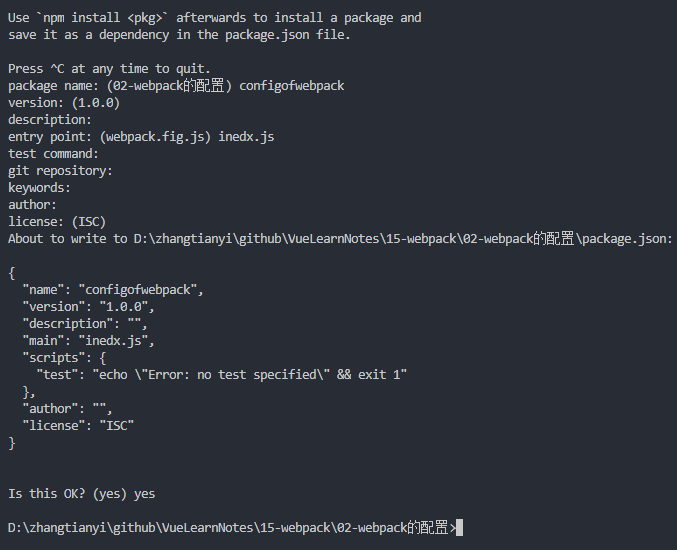

**3.使用 webpack 打包**

```shell
webkpack
```

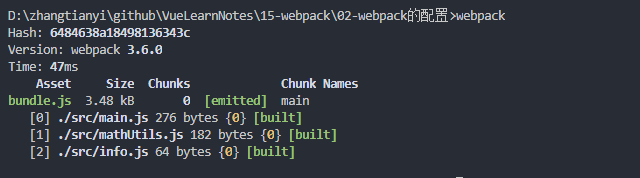

这样入口和出口的配置已经配置完成了，只需要使用 webpack 命令就行了。

4.使用自定义脚本（script）启动

一般来是我们使用的是

```shell
npm run dev//开发环境
npm run build//生产环境
```

在 package.json 中的 script 中加上

```json
"build": "webpack"
```

使用`npm run build`

```shell
npm run build
```

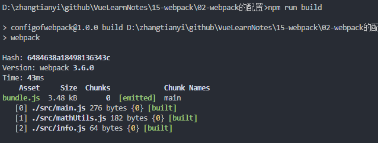

### 15.2.2 全局安装和局部安装

webpack 有全局安装和局部安装。

> 局部安装

**使用`npm run build`执行 webpack 会先从本地查找是否有 webpack，如果没有会使用全局的。**

此时本地需要安装 webapck

```shell
npm install webpack@3.6.0 --save-dev
```

package.json 中自动加上开发时的依赖`devDependencies`

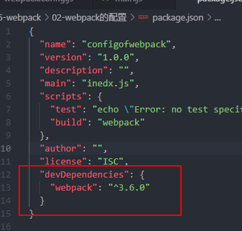

再次使用`npm run build`，使用的是本地 webpack 版本。

## 15.3 webpack 的 loader

### 15.3.1 什么是 loader

loader 是 webpack 中一个非常核心的概念。

webpack 可以将 js、图片、css 处理打包，但是对于 webpack 本身是不能处理 css、图片、ES6 转 ES5 等。

此时就需要 webpack 的扩展，使用对应的 loader 就可以。

**loader 使用**

> 步骤一：通过 npm 安装需要使用的 loader

> 步骤二：通过 webpack.config.js 中的 modules 关键字下进行配置

大部分 loader 可以在 webpack 的官网找到对应的配置。

### 15.3.2 CSS 文件处理

> 准备工作：复制 02-webpack 的配置到根目录，改名字为 03-webpack 的 loader

**1.将除了入口文件（main.js）所有 js 文件放在 js 文件夹，新建一个 css 文件夹，新建一个 normal.css 文件**

> normal.css

```css
body {
	background-color: red;
}
```

**2.main.js 导入依赖**

```javascript
//4.依赖css文件
require('./css/normal.css');
```

此时如果直接进行打包`npm run build`。

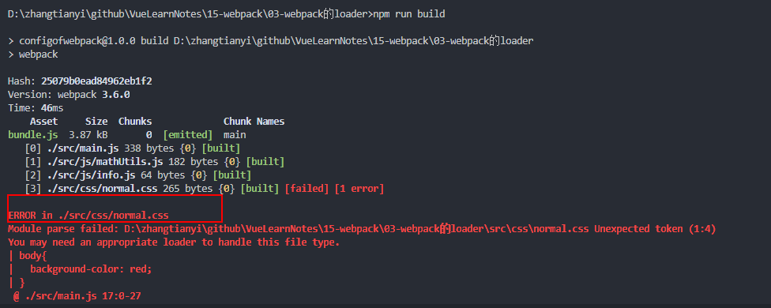

> 提示信息很清楚，打包到 css 文件时报错，提示我们可能需要一个 loader 来处理 css 文件。

**3.安装 css-loader**

```shell
npm install --save-dev css-loader
```

**4.使用 css-loader**

```javascript
module.exports = {
	module: {
		rules: [
			{
				test: /\.css$/, //正则表达式匹配css文件
				//css-loader只负责css文件加载，不负责解析，要解析需要使用style-loader
				use: [
					{
						loader: 'css-loader',
					},
				], //使用loader
			},
		],
	},
};
```

> 执行`npm run build`，提示打包成功，但是背景色并没有变红色，是因为 css-loader 只负责加载 css 文件，不负责解析，如果要将样式解析到 dom 元素中需要使用 style-loader。

5.安装使用 style-loader

```shell
npm install --save-dev style-loader
```

```javascript
module: {
	rules: [
		{
			test: /\.css$/, //正则表达式匹配css文件
			//css-loader只负责css文件加载，不负责解析，要解析需要使用style-loader
			use: [
				{
					loader: 'style-loader',
				},
				{
					loader: 'css-loader',
				},
			], //使用loader
		},
	];
}
```

> webpack 使用多个 loader 是从右往左解析的，所以需要将 css-loader 放在 style-loader 右边，先加载后解析。

此时样式成加载解析到 DOM 元素上。

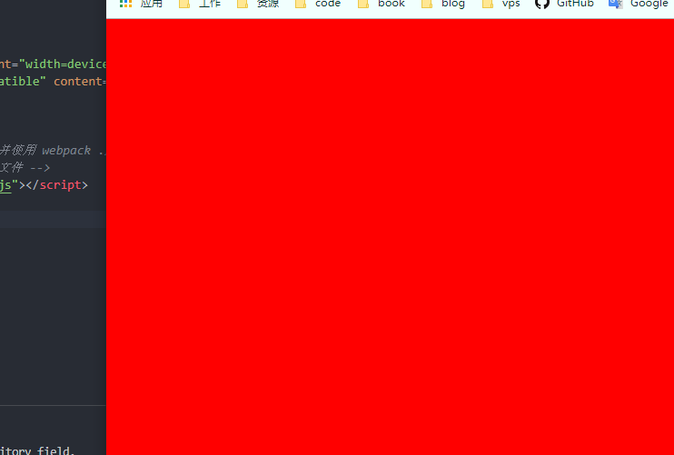

### 15.3.3 less 文件处理

**1.在 css 文件夹中新增一个 less 文件**

> special.less

```less
@fontSize: 50px; //定义变量字体大小
@fontColor: orange; //定义变量字体颜色
body {
	font-size: @fontSize;
	color: @fontColor;
}
```

**2.main.js 中导入 less 文件模块**

```javascript
//5.依赖less文件
require('./css/special.less');
//6.向页面写入一些内容
document.writeln('hello,zzzz!');
```

**3.安装使用 less-loader**

```shell
npm install --save-dev less-loader less
```

在`webpack.config.js`中使用 less-loader

```javascript
module: {
	rules: [
		{
			test: /\.less$/, //正则表达式匹配css文件
			//css-loader只负责css文件加载，不负责解析，要解析需要使用style-loader
			use: [
				{
					loader: 'style-loader',
				},
				{
					loader: 'css-loader',
				},
				{
					loader: 'less-loader', //less文件loader
				},
			], //使用loader
		},
	];
}
```

**4.执行 npm run build**

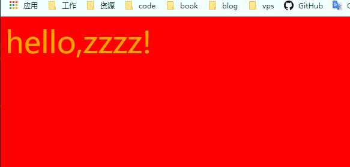

less 文件生效了，字体是 orange，大小为 50px。

### 15.3.4 图片文件的处理

> 准备工作，准备两张图片，图片大小为一张 8KB 以下（实际大小为 5KB，名称为 small.jpg），一张大于 8KB（实际大小为 10KB，名称为 big.jpg），新建一个 img 文件夹将两张图片放入。

**1.修改 normal.css 样式，先使用小图片作为背景**

```
body{
  /* background-color: red; */
  background: url("../img/small.jpg");
}
```

此时如果直接使用 npm run build 直接打包会报错，因为 css 文件中引用了图片 url，此时需要使用**url-loader**。

**2.安装使用 url-loader 处理图片**

url-loader 像 file loader 一样工作，但如果文件小于限制，可以返回 [data URL](https://tools.ietf.org/html/rfc2397) 。

```shell
npm install --save-dev url-loader
```

配置

```javascript
{
        test: /\.(png|jpg|gif)$/,//匹配png/jpg/gif格式图片
        use: [
          {
            loader: 'url-loader',
            options: {
              limit: 8192//图片小于8KB时候将图片转成base64字符串，大于8KB需要使用file-loader
            }
          }
        ]
      }
```

**3.打包**

使用 npm run build 打包后，打开 index.html。

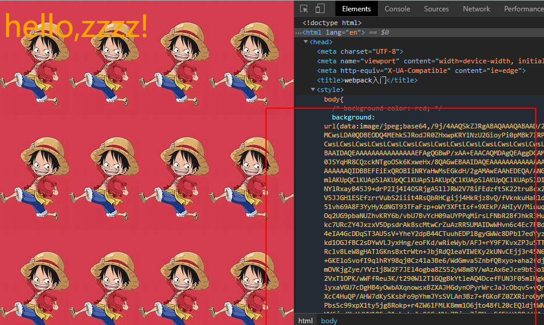

> 小于`limit`大小的图片地址被编译成 base64 格式的字符串。

此时修改 css 文件，使用 big.jpg 做背景。

```css
body {
	/* background-color: red; */
	/* background: url("../img/small.jpg"); */
	background: url('../img/big.jpg');
}
```

再次打包，报错，提示未找到 file-loader 模块。

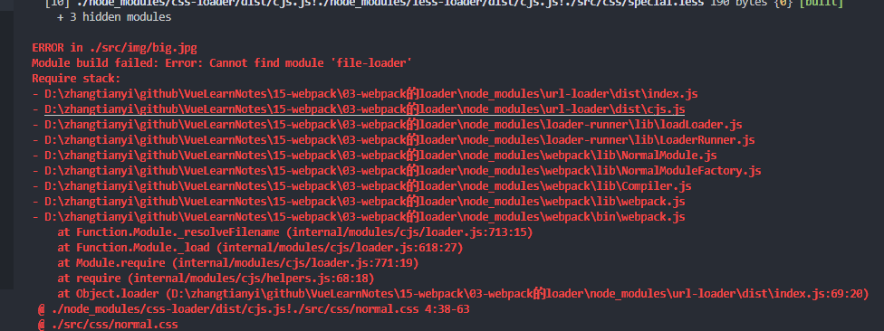

> 因为大于`limit`的图片需要`file-loader`来打包。

**4.安装使用 file-loader 处理图片**

```shell
npm install --save-dev file-loader
```

不需要配置，因为 url-loader 超过 limit 的图片会直接使用 file-loader。

再次打包，没有报错，打包成功，但是图片未显示。

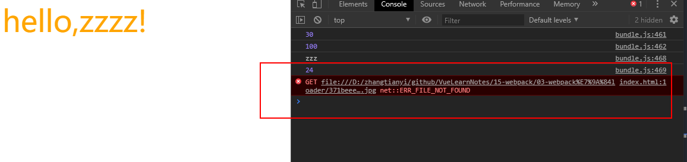

> 1.当加载的图片大小小于 limit，使用 base64 将图片编译成字符串
>
> 2.当加载的图片大小大于 limit，使用 file-loader 模块直接将 big.jpg 直接打包到 dist 文件家，文件名会使用 hash 值防止重复。
>
> 3.此时由于文件路径不对所以导致没有加载到图片

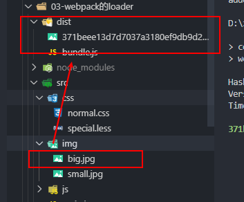

**5.如何使用 file-loader，指定路径**

修改 output 属性

```javascript
  output:{
    path: path.resolve(__dirname, 'dist'),//动态获取打包后的文件路径,path.resolve拼接路径
    filename: 'bundle.js',//打包后的文件名
    publicPath: 'dist/'
  },
```

此时打包，图片正常显示

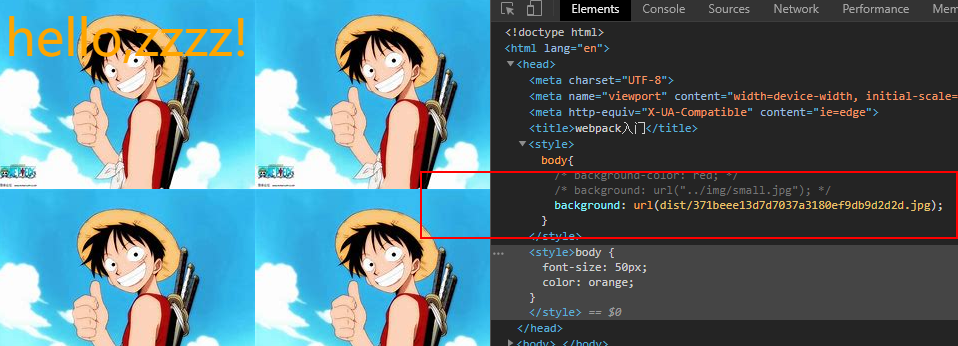

> 注意：一般来说，index.html 最终也会打包到 dist 文件夹下，所以，并不需要配置 publicPath，如何打包 index.html 请看 webpack 处理.vue 文件。

> file-loader 打包后，使用 hash 值做文件名太长，此时可以使用 options 的一些配置。

```javascript
options: {
              limit: 8192,//图片小于8KB时候将图片转成base64字符串，大于8KB需要使用file-loader
              name: 'img/[name].[hash:8].[ext]'//img表示文件父目录，[name]表示文件名,[hash:8]表示将hash截取8位[ext]表示后缀
            }
```

> 修改 options，加上 name 属性，其中 img 表示文件父目录，[name]表示文件名,[hash:8]表示将 hash 截取 8 位[ext]表示后缀

再次打包


### 15.3.5 ES6 语法处理

webpack 打包时候 ES6 语法没有打包成 ES5 语法，如果需要将 ES6 打包成 ES5 语法，那么就需要使用 babel。直接使用 babel 对应的 loader 就可以了。

安装

```shell
npm install --save-dev babel-loader@7 babel-core babel-preset-es2015
```

配置

```javascript
      {
        test: /\.js$/,
        //排除node模块的js和bower的js
        exclude: /(node_modules|bower_components)/,
        use: {
          loader: 'babel-loader',
          options: {
            //如果要使用@babel/preset-env这里需要在根目录新建一个babel的文件
            // presets: ['@babel/preset-env']
            //这里直接使用指定
            presets: ['es2015']
          }
        }
      }
```

> 1.如果要使用@babel/preset-env 这里需要在根目录新建一个 babel 的文件
>
> 2.exclude 排除不需要打包的文件

## 15.4 webpack 的 vue

### 15.4.1 简单安装使用 vue

如果需要使用 vue，必须使用 npm 先安装 vue。

```shell
npm install vue --save
```

使用 vue 简单开发。

> 准备工作

复制`03-webpack的loader`到同级目录，改名为`04-webpack的vue`，并在`04-webpack的vue`根目录执行`npm install vue --save `，下载安装 vue。

**1.在入口文件 main.js 导入已安装的 vue，并在 index.html 声明要挂载的 div。在 main.js 加入以下代码。**

```javascript
//6.使用vue开发
import Vue from 'vue';

const app = new Vue({
	el: '#app',
	data: {
		message: 'hello webpack and vue',
	},
});
```

修改 index.html 代码，添加

```html
<div id="app">
	<h2>{{message}}</h2>
</div>
```

**2.再次打包`npm run build`后打开 index.html**

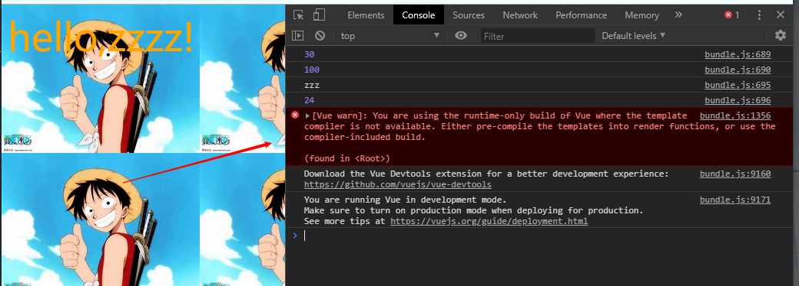

发现 message 并没有正确显示，打开 console 发现 vue 报错。错误提示我们，正在使用`runtime-only`构建，不能将 template 模板编译。

> 1.`runtime-only`模式，代码中不可以有任何 template，因为无法解析。
>
> 2.`runtime-complier`模式，代码中可以有 template，因为 complier 可以用于编译 template。

在 webpack 中配置，设置指定使用`runtime-complier`模式。

> webpack.config.js

```javascript
  resolve: {
    // alias:别名
    alias: {
        //指定vue使用vue.esm.js
      'vue$':'vue/dist/vue.esm.js'
    }
  }
```

**3.重新打包，显示正确**


### 15.4.2 如何分步抽取实现 vue 模块

> 创建 vue 的 template 和 el 关系
>
> el 表示挂载 DOM 的挂载点
>
> template 里面的 html 将替换挂载点

一般我们使用 vue 会开发单页面富应用(single page application)，只有一个 index.html，而且 index.html 都是简单结构。

```html
<!DOCTYPE html>
<html lang="en">
	<head>
		<meta charset="UTF-8" />
		<meta name="viewport" content="width=device-width, initial-scale=1.0" />
		<meta http-equiv="X-UA-Compatible" content="ie=edge" />
		<title>webpack入门</title>
	</head>
	<body>
		<div id="app"></div>
		<script src="./dist/bundle.js"></script>
	</body>
</html>
```

**1.第一次抽取，使用 template 替换`<div id="app"></div>`。**

> 修改 mian.js 的 vue 相关代码

```javascript
//6.使用vue开发
import Vue from 'vue';

new Vue({
	el: '#app',
	template: `
  <div>
    <h2>{{message}}</h2>
    <button @click='btnClick'>这是一个按钮</button>
    <h2>{{name}}</h2>
  </div>
  `,
	data: {
		message: 'hello webpack and vue',
		name: 'zzzz',
	},
	methods: {
		btnClick() {
			console.log('按钮被点击了');
		},
	},
});
```

使用 template 模板替换挂载的 id 为 app 的 div 元素，此时不需要修改 html 代码了，只需要写 template。

再次打包，显示成功。

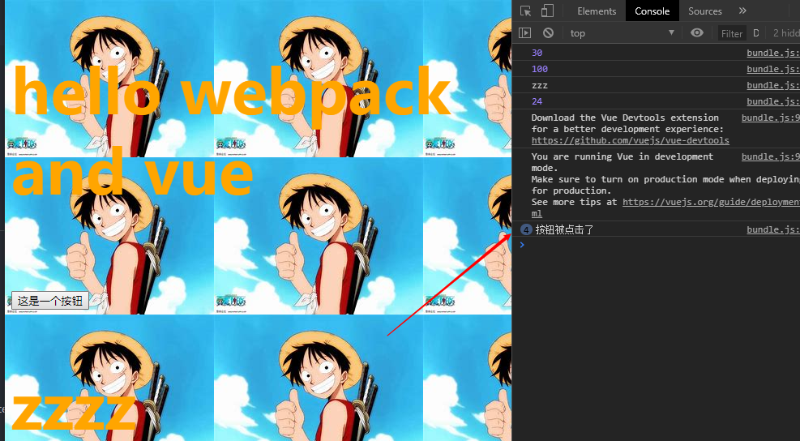

**2.第二次抽取，使用组件化思想替换 template**

考虑第一次抽取，写在 template 中，main.js 的 vue 代码太冗余。

> 修改 main.js 的代码

```javascript
//1.定义一个组件
const App = {
	template: `
  <div>
    <h2>{{message}}</h2>
    <button @click='btnClick'>这是一个按钮</button>
    <h2>{{name}}</h2>
  </div>
  `,
	data() {
		return {
			message: 'hello webpack and vue',
			name: 'zzzz',
		};
	},
	methods: {
		btnClick() {
			console.log('按钮被点击了');
		},
	},
};
```

> 修改 main.js，vue 实例中注册组件，并使用组件

```javascript
new Vue({
	el: '#app',
	//使用组件
	template: '<App/>',
	components: {
		//注册局部组件
		App,
	},
});
```

再次使用`npm run build`打包，打包成功，显示和使用 template 替换 div 一样。

**3.第三次抽取组件对象，封装到新的 js 文件，并使用模块化导入 main.js**

此处我的 vue-loader 是 15.7.2。

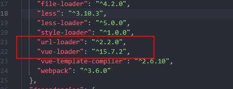

将其修改为 13.0.0

```json
"vue-loader": "^13.0.0"
```

重新安装版本

```shell
npm install
```

再次打包，打包成功，样式生效了。


**6.组件化开发**

我们使用 app.vue 分离了模板、行为、样式，但是不可能所有的模板和样式都在一个 vue 文件内，所以要用组件化。

在 vue 文件夹下新建一个 Cpn.vue 文件

> Cpn.vue 组件

```vue
<template>
	<div>
		<h2 class="title">{{ name }}</h2>
	</div>
</template>

<script type="text/ecmascript-6">
export default {
  name: "Cpn",
  data() {
      return {
        name: "组件名字是Cpn"
      };
    }
};
</script>

<style scoped>
.title {
	color: red;
}
</style>
```

将 Cpn.vue 组件导入到 App.vue

```vue
<template>
	<div>
		<h2 class="title">{{ message }}</h2>
		<button @click="btnClick">按钮</button>
		<h2>{{ name }}</h2>
		<!-- 使用Cpn组件 -->
		<Cpn />
	</div>
</template>

<script type="text/ecmascript-6">
//导入Cpn组件
import Cpn from './Cpn.vue'
export default {
  name: "App",
  data() {
      return {
        message: "hello webpack",
        name: "zzz"
      };
    },
    methods: {
      btnclick() {}
    },
    components: {
      Cpn//注册Cpn组件
    }
};
</script>

<style scoped>
.title {
	color: green;
}
</style>
```

再次打包，打开 index.html，cpn 组件的内容显示


基于此，一个 vue 文件可以依赖导入很多 vue 文件，组成一个单页面富应用。

> 如果你在使用 ES6 语法导入模块时候想要简写的时候，例如这样省略`.vue`后缀

```javascript
import Cpn from './Cpn';
```

可以在`webpack.config.js`中配置：

```javascript
  resolve: {
    //导入模块简写省略指定后缀
    extensions: ['.js', '.css', '.vue'],
    // alias:别名
    alias: {
      //指定vue使用vue.esm.js
      'vue$':'vue/dist/vue.esm.js'
    }
  }
```

## 15.5 webpack 的 plugin

plugin 插件用于扩展 webpack 的功能的扩展，例如打包时候优化，文件压缩。

**loader 和 plugin 的区别**

loader 主要用于转化某些类型的模块，是一个转化器。

plugin 主要是对 webpack 的本身的扩展，是一个扩展器。

**plugin 的使用过程**

步骤一：通过 npm 安装需要使用的 plugins(某些 webpack 已经内置的插件不需要在安装)

步骤二：在**webpack.config.js**中的 plugins 中配置插件。

> 准备工作
>
> 复制 04-webpack 的 vue 到同级目录，并改名为 05-webpack 的 plugin

### 15.5.1 添加版权的 Plugin

BannerPlugin 插件是属于 webpack 自带的插件可以添加版权信息。

自带的插件无需安装，直接配置。

先获取 webpack 的对象，在配置 BannerPlugin 插件。

```javascript
//获取webpack
const webpack = require('webpack')
//2.配置plugins
module.exports = {
    ...
    plugins:[
        new webpack.BannerPlugin('最终解释权归zz所有')
      ]
}
```

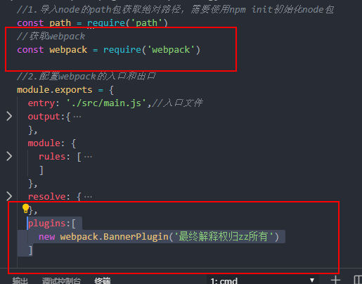

打包后，查看 bundle.js，结果如图所示：

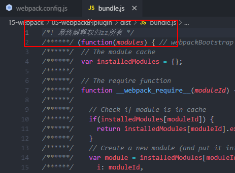

多了一行我们自定义的版权声明注释。

### 15.5.2 打包 html 的 plugin

之前我们的 index.html 文件都是存放在根目录下的。

在正式发布项目的时候发布的是 dist 文件夹的内容，但是 dist 文件夹是没有 index.html 文件的，那么打包就没有意义了。

所以我们需要将 index.html 也打包到 dist 文件夹中，这就需要使用**`HtmlWebpackPlugin`**插件了。

> **`HtmlWebpackPlugin`**：
>
> 自动生成一个 index.html 文件（指定模板）
>
> 将打包的 js 文件，自动同 script 标签插入到 body 中

首先需要安装**`HtmlWebpackPlugin`**插件

```shell
npm install html-webpack-plugin --save-dev
```

使用插件，修改 webpack.config.js 文件中的 plugins 部分

```javascript
//获取htmlWebpackPlugin对象
const htmlWbepackPlugin = require('html-webpack-plugin')
//2.配置plugins
module.exports = {
    ...
    plugins:[
        new webpack.BannerPlugin('最终解释权归zz所有'),
        new htmlWbepackPlugin({
          template: 'index.html'
        })
      ]
}
```

> 1.template 表示根据哪个模板来生成 index.html
>
> 2.需要删除 output 中添加的 publicPath 属性，否则插入的 script 标签的 src 可能有误

再次打包，打开 dist 文件夹，多了一个 index.html

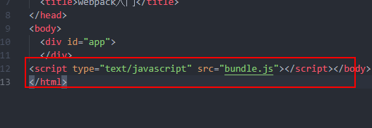

自动加入了 script 引入了 bundle.js。

### 15.5.3 压缩打包代码插件

uglifyjs-webpack-plugin 是第三方插件，如果是 vuecli2 需要指定版本 1.1.1。

安装：

```shell
npm install uglifyjs-webpack-plugin@1.1.1 --save-dev
```

配置 plugin

```javascript
//获取uglifyjs-webpack-plugin对象
const uglifyjsWebpackPlugin = require('uglifyjs-webpack-plugin')
//2.配置plugins
module.exports = {
    ...
    plugins:[
        new webpack.BannerPlugin('最终解释权归zz所有'),
        new htmlWbepackPlugin({
          template: 'index.html'
        }),
    	new uglifyjsWebpackPlugin()
      ]
}
```

打包过后，打开 bundle.js，发现已经压缩了，此时版权声明被删除了。

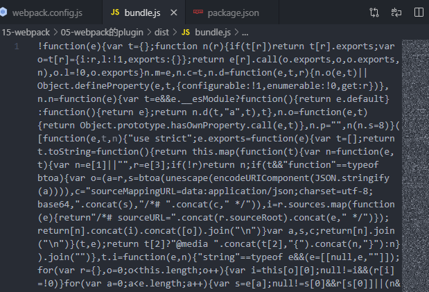

> webpack 高版本自带了压缩插件。

## 15.6 webpack 搭建本地服务器

webpack 提供了一个可选的本地开发服务器，这个本地服务器基于 node.js 搭建，内部使用了 express 框架，可以实现热启动。

> 准备工作复制 05-webpack 的 plugin 文件夹到同级目录，并改名为 06-webpack 搭建本地服务器。

不过这是一个单独的模块，在 webpack 中使用之前需要先安装：

```shell
npm install --save-dev webpack-dev-server@2.9.1
```

devServe 也是 webpack 中一个选项，选项本省可以设置一些属性：

-   contentBase：为哪个文件夹提供本地服务，默认是根文件夹，这里我们需要改成./dist
-   port：端口号
-   inline：页面实时刷新
-   historyApiFallback：在 SPA（单页面富应用）页面中，依赖 HTML5 的 history 模式

修改 webpack.config.js 的文件配置

```javascript
//2.配置webpack的入口和出口
module.exports = {
 ...
  devServer: {
    contentBase: './dist',//服务的文件夹
    port: 4000,
    inline: true//是否实时刷新
  }

}

```

配置 package.json 的 script：

```json
"dev": "webpack-dev-server --open"
```

> --open 表示直接打开浏览器

启动服务器

```shell
npm run dev
```

启动成功，自动打开浏览器，发现在本地指定端口启动了，此时你修改 src 文件内容，**会热修改。**

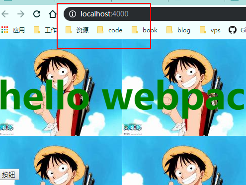

> 1.服务器启动在内存中。
>
> 2.开发调试时候最好不要使用压缩 js 文件的插件，不易调试。

## 15.7 webpack 的配置文件分离

`webpack.config.js`文件中有些是开发时候需要配置，有些事生产环境发布编译需要的配置，比如搭建本地服务器的 devServer 配置就是开发时配置，接下来我们分析如何分离配置文件。

> 准备工作：复制 06-webpack 搭建本地服务器文件夹到同级目录，并改名为 07-webpack 的配置文件分离。

在根目录下新建一个`build`的文件夹，新建配置文件。

> base.config.js（公共的配置）

```javascript
//1.导入node的path包获取绝对路径，需要使用npm init初始化node包
const path = require('path');
//获取webpack
const webpack = require('webpack');
//获取htmlWebpackPlugin对象
const htmlWbepackPlugin = require('html-webpack-plugin');

//2.配置webpack的入口和出口
module.exports = {
	entry: './src/main.js', //入口文件
	output: {
		path: path.resolve(__dirname, 'dist'), //动态获取打包后的文件路径,path.resolve拼接路径
		filename: 'bundle.js', //打包后的文件名
		// publicPath: 'dist/'
	},
	module: {
		rules: [
			{
				test: /\.css$/, //正则表达式匹配css文件
				//css-loader只负责css文件加载，不负责解析，要解析需要使用style-loader
				use: [
					{
						loader: 'style-loader',
					},
					{
						loader: 'css-loader',
					},
				], //使用loader
			},
			{
				test: /\.less$/, //正则表达式匹配css文件
				//css-loader只负责css文件加载，不负责解析，要解析需要使用style-loader
				use: [
					{
						loader: 'style-loader',
					},
					{
						loader: 'css-loader',
					},
					{
						loader: 'less-loader', //less文件loader
					},
				], //使用loader
			},
			{
				test: /\.(png|jpg|gif)$/, //匹配png/jpg/gif格式图片
				use: [
					{
						loader: 'url-loader',
						options: {
							limit: 8192, //图片小于8KB时候将图片转成base64字符串，大于8KB需要使用file-loader
							name: 'img/[name].[hash:8].[ext]', //img表示文件父目录，[name]表示文件名,[hash:8]表示将hash截取8位[ext]表示后缀
						},
					},
				],
			},
			{
				test: /\.js$/,
				//排除node模块的js和bower的js
				exclude: /(node_modules|bower_components)/,
				use: {
					loader: 'babel-loader',
					options: {
						//如果要使用@babel/preset-env这里需要在根目录新建一个babel的文件
						// presets: ['@babel/preset-env']
						//这里直接使用指定
						presets: ['es2015'],
					},
				},
			},
			{
				test: /\.vue$/, //正则匹配.vue文件
				use: {
					loader: 'vue-loader',
				},
			},
		],
	},
	resolve: {
		// alias:别名
		alias: {
			//指定vue使用vue.esm.js
			vue$: 'vue/dist/vue.esm.js',
		},
	},
	plugins: [
		new webpack.BannerPlugin('最终解释权归zz所有'),
		new htmlWbepackPlugin({
			template: 'index.html',
		}),
	],
};
```

> dev.config.js（开发时候需要的配置）

```javascript
module.exports = {
	devServer: {
		contentBase: './dist', //服务的文件夹
		port: 4000,
		inline: true, //是否实时刷新
	},
};
```

> prod.config.js（构建发布时候需要的配置）

```javascript
const uglifyjsWebpackPlugin = require('uglifyjs-webpack-plugin');

module.exports = {
	plugins: [new uglifyjsWebpackPlugin()],
};
```

此时我们将`webpack.config.js`文件分成了三个部分，公共部分、开发部分、构建发布的部分。

> 1.如果此时是 dev 环境，我们只需要使用`base.config.js`+`dev.config.js`的内容
>
> 2.如果此时是生产发布构建的环境，我们只需要使用`base.config.js`+`prod.config.js`的内容

要将两个文件内容合并需要使用`webpack-merge`插件，安装`webpack-merge`。

```shell
npm isntall webpack-merge --save-dev
```

合并内容都是将`base.config.js`的内容合并到 dev 或者 prod 的文件中，修改`dev.config.js`和`prod.config.js`文件。

> 修改 dev.config.js

```javascript
//导入webpack-merge对象
const webpackMerge = require('webpack-merge');
//导入base.config.js
const baseConfig = require('./base.config');

//使用webpackMerge将baseConfig和dev.config的内容合并
module.exports = webpackMerge(baseConfig, {
	devServer: {
		contentBase: './dist', //服务的文件夹
		port: 4000,
		inline: true, //是否实时刷新
	},
});
```

> 修改 prod.config.js

```javascript
const uglifyjsWebpackPlugin = require('uglifyjs-webpack-plugin');
//导入webpack-merge对象
const webpackMerge = require('webpack-merge');
//导入base.config.js
const baseConfig = require('./base.config');

//使用webpackMerge将baseConfig和prod.config的内容合并
module.exports = webpackMerge(baseConfig, {
	plugins: [new uglifyjsWebpackPlugin()],
});
```

此时我们使用三个文件构成了配置文件，此时在不同环境使用不同的配置文件，但是 webpack 不知道我们新配置文件，此时我们需要在 package.json 中的 script 指定要使用的配置文件。

```json
"scripts": {
    "test": "echo \"Error: no test specified\" && exit 1",
    "build": "webpack --config ./build/prod.config.js",
    "dev": "webpack-dev-server --open --config ./build/dev.config.js"
  }
```

此时使用`npm run build`打包文件，dist 文件并不在根目录下，因为我们在`base.config.js`中配置的出口文件使用的是当前文件的路径，即打包的根路径是配置文件的当前路径，也就是 build 文件夹。

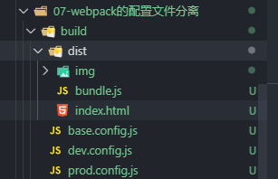

```javascript
  entry: './src/main.js',//入口文件
  output:{
    path: path.resolve(__dirname, 'dist'),//动态获取打包后的文件路径,path.resolve拼接路径
    filename: 'bundle.js',//打包后的文件名
    // publicPath: 'dist/'
  }
```

> 注意：\_\_dirname 是当前文件路径，path.resolve 拼接路径，所以在当前路径下创建了一个 dist 文件夹。

此时修改 output 属性：

```javascript
output:{
    path: path.resolve(__dirname, '../dist'),//动态获取打包后的文件路径,path.resolve拼接路径
    filename: 'bundle.js',//打包后的文件名
    // publicPath: 'dist/'
  }
```

> 使用`../dist`，在当前目录的上级目录创建 dist 文件夹
