# （十七）vue-router

## 17.1 路由简介

**什么是路由？**

-   路由就是通过互联的网络把信息用源地址传送到目的地的活动

-   路由提供了两种机制：路由和传送
    -   路由是决定数据包从来源到目的地的路径
    -   转送就是将数据转移
-   路由表
    -   路由表本质就是一个映射表，决定了数据包的指向

## 17.2 前端/后端路由

1. 后端渲染（服务端渲染）
   jsp 技术
   后端路由，后端处理 URL 和页面映射关系，例如 springmvc 中的@requestMapping 注解配置的 URL 地址，映射前端页面
2. 前后端分离（ajax 请求数据）
   后端只负责提供数据
   静态资源服务器（html+css+js）
   ajax 发送网络请求后端服务器，服务器回传数据
   js 代码渲染 dom
3. 单页面富应用（SPA 页面）
   前后端分离加上前端路由，前端路由的 url 映射表不会向服务器请求，是单独 url 的的页面自己的 ajax 请求后端，后端只提供 api 负责响应数据请求。改变 url，页面不进行整体的刷新。
   整个网站只有一个 html 页面。

## 17.3 URL 的 hash 和 HTML5 的 history

### 17.3.1 URL 的 hash

-   URL 的 hash 是通过锚点(#)，其本质上改变的是 window.location 的 href 属性。
-   可以通过直接赋值 location.hash 来改变 href，但是页面并不会发生刷新。

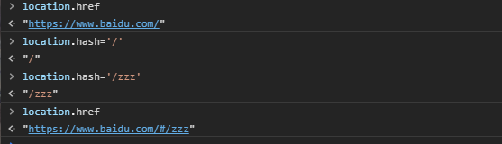

使用命令`vue init webpack 01-vue-router-vuecli2`创建新的 vuecli2 工程,等待创建完成后，使用`npm run dev`启动服务器，在浏览器通过 http://localhost:8080 进入工程主页。 测试通过改变 hash，查看是否会刷新页面，浏览器的 url 地址是否改变。

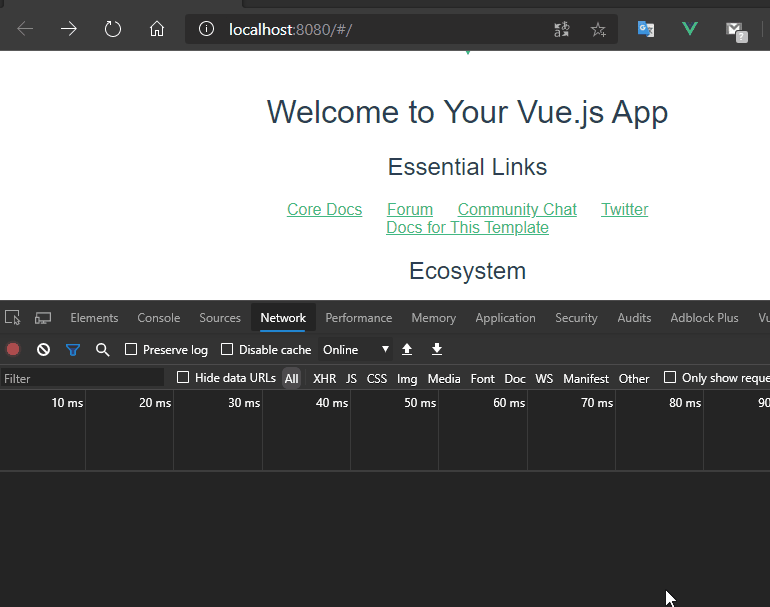

> 结论

测试发现 url 的地址栏改变了变成了 http://localhost:8080/#/zty ，通过查看 network 发现只有 favicon.ico 资源重新请求了，这个是工程的 logo 图标，其他资源都未请求。可以通过改变 hash 改变 url，此时页面是未刷新的。

vue-router 其实用的就是这样的机制，改变 url 地址，这个 url 地址存在一份路由映射表里面，比如`/user`代表要请求用户页面，只要配置了这个路由表（路由关系），就可以前端跳转而不刷新页面，所有的数据请求都走 ajax。

### 17.3.1 HTML5 的 history 模式

> pushState

同样的使用 HTML5 的 history 模式也是不会刷新页面的,history 对象栈结构，先进后出，pushState 类似压入栈中，back 是回退。

```js
hristory.pushState({}, '', '/foo');
history.back();
```

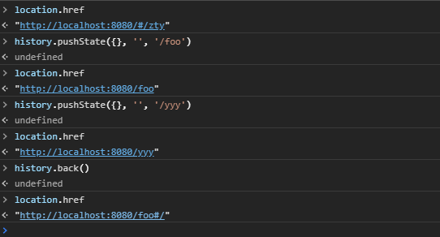

> replaceState

replaceState 模式与 pushState 模式区别在于 replaceState 模式浏览器没有返回只是替换，不是压入栈中。

```js
history.replaceState({}, '', 'home');
```

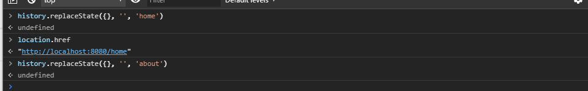

> go

go 只能在 pushState 模式中使用，go 是前进后退到哪个历史页面。

```js
history.go(-1); //回退一个页面
history.go(1); //前进一个页面
history.forward(); //等价于go(1)
history.back(); //等价于go(-1)
```

## 17.4 vue-router 的安装配置

1. 使用`npm install vue-router --save`来安装 vue-router 插件模块

2. 在模块化工程中使用他(因为是一个插件，所以可以通过 Vue.user 来安装路由功能)

    - 在 src 下创建一个 router 文件夹（一般安装 vue-router 时候会自动创建）用来存放 vue-router 的路由信息导入路由对象，并且调用**Vue.use(VueRouter)**
    - 创建路由实例，并且传入路由**映射配置**
    - 在 vue 实例中挂载创建的**路由实例对象**

    > router 文件夹中的 index.js

```js
/**
 * 配置路由相关信息
 * 1.先导入vue实例和vue-router实例
 */
import Vue from 'vue';
import Router from 'vue-router';
import HelloWorld from '@/components/HelloWorld';

// 2. 通过Vue.use(插件)，安装插件
Vue.use(Router);
//3. 创建 router路由对象
const routes = [
	//配置路由和组件之间的对应关系
	{
		path: '/', //url
		name: 'HelloWorld',
		component: HelloWorld, //组件名
	},
];
const router = new Router({
	//配置路由和组件之间的应用关系
	routes,
});
//4.导出router实例
export default router;
```

> main.js 中挂载 router 对象

```js
/* eslint-disable no-new */
new Vue({
	el: '#app',
	router, //使用路由对象，简写对象增强写法
	render: (h) => h(App),
});
```

## 17.4 vue-router 的使用

### 17.4.1 创建路由组件

在 components 文件夹下创建 2 个组件。

> Home 组件

```vue
<template>
	<div class="page-contianer">
		<h2>这是首页</h2>
		<p>我是首页的内容,123456.</p>
	</div>
</template>
<script type="text/ecmascript-6">
export default {
  name: 'Home'
}
</script>
<style scoped></style>
```

> About 组件

```vue
<template>
	<div class="page-contianer">
		<h2>这是关于页面</h2>
		<p>我是关于页面的内容，about。</p>
	</div>
</template>
<script type="text/ecmascript-6">
export default {
  name: 'About'
}
</script>
<style scoped></style>
```

### 17.4.2 配置路由映射：组件和路径映射关系

在路由与组件对应关系配置在`routes`中。

> 修改 index.js

```js
import Vue from 'vue';
import Router from 'vue-router';
import Home from '@/components/Home';

// 2. 通过Vue.use(插件)，安装插件
Vue.use(Router);
//3. 创建 router路由对象
const routes = [
	//配置路由和组件之间的对应关系
	{
		path: '/home', //home  前端路由地址
		name: 'Home',
		component: Home, //组件名
	},
	{
		path: '/about', //about 前端路由地址
		name: 'About',
		component: () => import('@/components/About'), //懒加载组件
	},
];
const router = new Router({
	//配置路由和组件之间的应用关系
	routes,
});
//4.导出router实例
export default router;
```

### 17.4.3 使用路由：通过`<router-link>`和`<router-view>`

在 app.vue 中使用`<router-link>`和`<router-view>` 两个全局组件显示路由。

> `<router-link>`是全局组件，最终被渲染成 a 标签，但是`<router-link>`只是标记路由指向类似一个 a 标签或者按钮一样，但是我们点击 a 标签要跳转页面或者要显示页面，所以就要用上`<router-view>`。
>
> `<router-view>` 是用来占位的，就是路由对应的组件展示的地方，该标签会根据当前的路径，动态渲染出不同的组件。
>
> 路由切换的时候切换的是`<router-view>`挂载的组件，其他不会发生改变。
>
> `<router-view>`默认使用 hash 模式，可以在 index.js 中配置修改为 history 模式。

> app.vue 修改 template

```vue
<template>
	<div id="app">
		<router-link to="/home">首页</router-link> |
		<router-link to="/about">关于</router-link>
		<router-view />
	</div>
</template>
```

使用`npm run dev`启动项目，此时`<router-view>`在`<router-link>`下面，那渲染页面就在下面，此时未配置路由的默认值，所以第一次进入网页的时候`<router-view>`占位的地方是没有内容的。

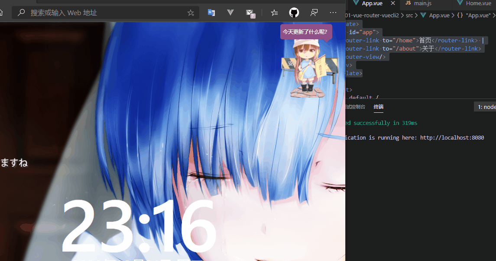

### 17.4.4 路由的默认值和 history 模式

> 路由的默认值，修改 index.js 的 routes

```js
const routes = [
	{
		path: '',
		redirect: '/home', //缺省时候重定向到/home
	},
	//配置路由和组件之间的对应关系
	{
		path: '/home', //home  前端路由地址
		name: 'Home',
		component: Home, //组件名
	},
	{
		path: '/about', //about 前端路由地址
		name: 'About',
		component: () => import('@/components/About'), //懒加载组件
	},
];
```

添加缺省值，并重定向到`/home`路径，此时打开 http://localhost:8080 ，直接显示 home 组件内容。

> 修改 hash 模式为 history 模式，修改 index.js 的 router 对象

```js
const router = new Router({
	//配置路由和组件之间的应用关系
	routes,
	mode: 'history', //修改模式为history
});
```

此时发现浏览器地址栏的 URL 是没有`#`的。

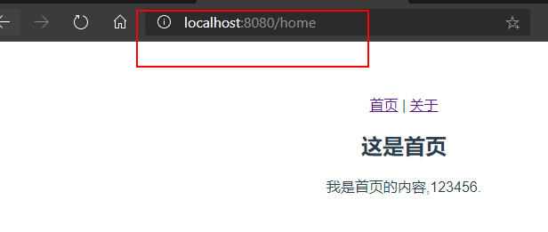

### 17.4.5 `<router-link>`的其他属性

1. `to`属性：用于跳转到指定路径。

2. `tag`属性：可以指定`<router-link>`之后渲染成什么组件使用`<router-link to='/home' tag='button'>`会被渲染成一个按钮，而不是 a 标签。

3. `relapce`属性：在 history 模式下指定`<router-link to='/home' tag='button' replace>`使用`replaceState`而不是 pushState，此时浏览器的返回按钮是不能使用的。

4. `active-class`属性：当`<router-link>`对应的路由匹配成功的时候，会自动给当前元素设置一个`router-link-active`的 class，设置 active-class 可以修改默认的名称。

-   在进行高亮显示的导航菜单或者底部 tabbar 时，会用到该属性
-   但是通常不会修改类的属性，会直接使用默认的`router-link-active`
-   `<router-link to='/home' tag='button' active-class='active'>`此时被选中的`<router-link>`就会有 active 的 class。
-   如果每个`<router-link>`都要加上`active-class='active'`，那就在路由里面统一更改。

    ```js
    const router = new Router({
    	//配置路由和组件之间的应用关系
    	routes,
    	mode: 'history', //修改模式为history
    	linkActiveClass: 'active',
    });
    ```

    ```vue
    <template>
    	<div id="app">
    		<router-link to="/home" tag="button" replace active-class="active"
    			>首页</router-link
    		>
    		|
    		<router-link to="/about" active-class="active">关于</router-link>
    		<router-view />
    	</div>
    </template>

    <script>
    export default {
    	name: 'App',
    };
    </script>

    <style>
    #app {
    	font-family: 'Avenir', Helvetica, Arial, sans-serif;
    	-webkit-font-smoothing: antialiased;
    	-moz-osx-font-smoothing: grayscale;
    	text-align: center;
    	color: #2c3e50;
    	margin-top: 60px;
    }
    .active {
    	color: red;
    }
    </style>
    ```

    修改 app.vue 文件此时被选中的`<router-link>`就有了 active 属性，给 active 的 class 加上字体变红的 css。

    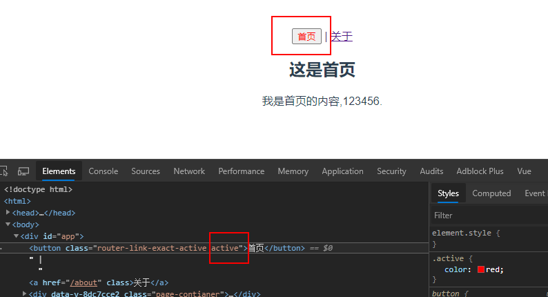

### 17.4.6 通过代码修改路由跳转

> \$router 属性

```vue
<template>
	<div id="app">
		<!-- <router-link to="/home" tag='button' replace active-class='active'>首页</router-link> |
    <router-link to="/about" active-class='active'>关于</router-link> -->
		<button @click="homeClick">首页</button>|
		<button @click="aboutClick">关于</button>
		<router-view />
	</div>
</template>

<script>
export default {
	name: 'App',
	methods: {
		homeClick() {
			//通过代码的路径修改路由
			this.$router.push('/home'); //push 等价于pushState
			// this.$router.replace('/home')//replace 等价于replaceState
			console.log('homeClick');
		},
		aboutClick() {
			this.$router.push('/about');
			// this.$router.replace('/about')//replace 等价于replaceState
			console.log('aboutClick');
		},
	},
};
</script>

<style>
#app {
	font-family: 'Avenir', Helvetica, Arial, sans-serif;
	-webkit-font-smoothing: antialiased;
	-moz-osx-font-smoothing: grayscale;
	text-align: center;
	color: #2c3e50;
	margin-top: 60px;
}
.active {
	color: red;
}
</style>
```

修改 app.vue，将`<router-link>`换成`button`等任何组件，添加上点击事件，并写好点击事件响应方法，此时使用`this.$router.push('/home')`，push 方法 等价于 pushState 方法，replace 方法等价于 replaceState 方法。

## 17.5 渐入 vue-router

### 17.5.1 vue-router 的动态路由

一个页面的 path 路径可能是不确定的，例如可能有`/user/aaaa`或者`/user/bbbb`，除了`/user`之外，后面还跟上了用户 ID`/user/123`等。这种 path 和 component 的匹配关系，叫动态路由。

> 新建一个 User 组件

```vue
<template>
	<div class="page-contianer">
		<h2>这是用户界面</h2>
		<p>这里是用户页面的内容。</p>
		<p>用户ID是: {{ userId }}</p>
	</div>
</template>
<script type="text/ecmascript-6">
export default {
  name: 'User',
  computed:{
    userId() {
      return this.$route.params.userId
    }
  }
}
</script>
<style scoped></style>
```

该组件定义一个计算属性，通过`this.$route.params.userId`获取处于激活状态的路由参数`userId`。

> 配置路由参数 index.js

```js
  {
    path: '/user/:userId',
    name: 'User',
    component: () => import('@/components/User') //懒加载组件
  }
```

使用`:userId`指定动态路由参数`userId`。

> app.vue 中添加 user 页面的`<router-link>`，并添加 userId 变量

```vue
<router-link :to="/user/ + userId">用户</router-link>
```

```js
  data (){
    return {
      userId: 'zty'
    }
```

启动项目，点击用户。

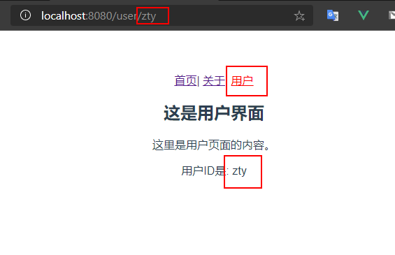

> 总结

`$route`是代表处于激活状态的路由，这里指的也就是

```js
  {
    path: '/user/:userId',
    name: 'User',
    component: () => import('@/components/User')
  }
```

通过`$route.params`获取 [`$route`](<[https://router.vuejs.org/zh/api/#%E8%B7%AF%E7%94%B1%E5%AF%B9%E8%B1%A1%E5%B1%9E%E6%80%A7](https://router.vuejs.org/zh/api/#路由对象属性)>) 所有的参数，`$route.params.userId`，获取所有参数中的名字叫`userId`的属性，此时可以在 User 组件中动态获取路由参数，也就可以在 app.vue 中动态设置路由中的`userId`，其他属性请参考 [`$route`](<[https://router.vuejs.org/zh/api/#%E8%B7%AF%E7%94%B1%E5%AF%B9%E8%B1%A1%E5%B1%9E%E6%80%A7](https://router.vuejs.org/zh/api/#路由对象属性)>) 。

### 17.5.2 vue-router 的打包文件解析

> 问题：打包时候 js 太大，页面响应缓慢

如果组件模块化了，当路由被访问的时候才开始加载被选中的组件，这样就是懒加载，前面也介绍过。

```js
component: () => import('@/components/User');
```

使用`npm run build`命令将之前创建的项目打包，打开 dist 文件夹，器目录结构如下：

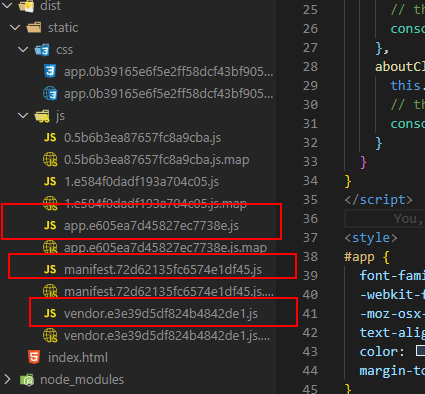

-   app.xxx.js 是我们自己编写的业务代码
-   vendor.xxx.js 是第三方框架，例如 vue/vue-router/axios 等
-   mainfest.xxx.js 是为了打包的代码做底层支持的，一般是 webpack 帮我们做一些事情
-   除了这三个还多了 2 个 js，这 2 个 js 文件（0.5bxxx.js 和 1.e5xxx.js）分别是 About 和 User 组件，因为这 2 个组件是懒加载的所以被分开打包了。

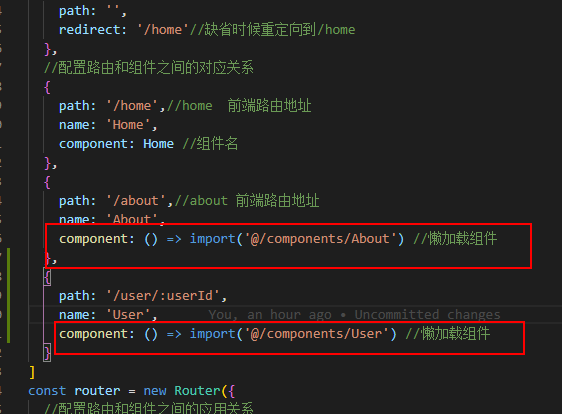

此时因为是懒加载，需要用到这个组件的时候才会加载，所以不会一次性请求所有 js。

### 17.5.3 认识嵌套路由

平常在一个 home 页面中，我们可能需要`/home/news`和`/home/message`访问一些内容，一个路由映射一个组件就像后端一个 api 对应一个 controller 的一个 requestMapping 一样，访问两个路由也会分别渲染这两个组件。

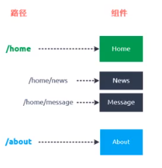

要实现嵌套路由：

1. 创建对应的子组件，并且在路由映射(`router/index.js`)中配置对应的子路由。

2. 在组件内部使用`<router-view>`标签来占位。

    > 新建 2 个组件 HomeNews 和 HomeMessage

```vue
<template>
	<div class="page-contianer">
		<ul>
			<li v-for="(item, index) in list" :key="index">
				{{ item + index + 1 }}
			</li>
		</ul>
	</div>
</template>
<script type="text/ecmascript-6">
export default {
  name: 'HomeNews',
  data() {
    return {
      list: ['新闻', '新闻', '新闻', '新闻']
    }
  }
}
</script>
<style scoped></style>
```

```vue
<template>
	<div class="page-contianer">
		<ul>
			<li v-for="(item, index) in list" :key="index">
				{{ item + index + 1 }}
			</li>
		</ul>
	</div>
</template>
<script type="text/ecmascript-6">
export default {
  name: 'HomeMessage',
  data() {
    return {
      list: ['消息', '消息', '消息', '消息']
    }
  }
}
</script>
<style scoped></style>
```

> 配置嵌套路由

```js
  {
    path: '/home',//home  前端路由地址
    name: 'Home',
    component: Home, //组件名
    children: [
      {
        path: '',
        redirect: '/home/news'//缺省时候重定向到/home/news
      },
      {
        path: 'news',//子嵌套路由 无须加/
        name: 'News',
        component: () => import('@/components/HomeNews') //懒加载组件
      },
      {
        path: 'message',
        name: 'Message',
        component: () => import('@/components/HomeMessage') //懒加载组件
      }
    ]
  },
```

> 修改 Home.vue 组件加上`<router-link>`和`<router-view/>`

```vue
<template>
	<div class="page-contianer">
		<h2>这是首页</h2>
		<p>我是首页的内容,123456.</p>
		<router-link to="/home/news">新闻</router-link>|
		<router-link to="/home/message">消息</router-link>
		<router-view />
	</div>
</template>
```

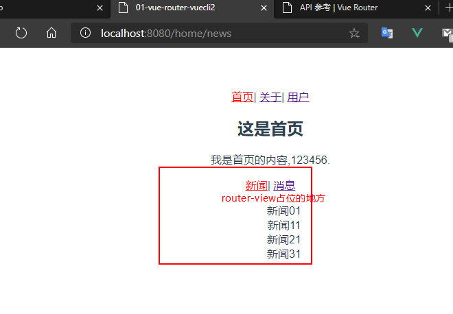

### 17.5.4 vue-router 的参数传递

之前的动态路由说的`userId`也是参数传递的方式的一种，准备新建一个 Profile.vue 组件，并配置路由映射，添加指定的`<router-link>`。

```vue
<template>
	<div class="page-contianer">
		<h2>这是档案界面</h2>
		<p>这里是档案页面的内容。</p>
		<p>档案的名字是: {{ profileInfo.name }}</p>
		<p>档案的年龄是: {{ profileInfo.age }}</p>
		<p>档案的身高是: {{ profileInfo.height }}</p>
	</div>
</template>
<script type="text/ecmascript-6">
export default {
  name: 'Profile',
  computed: {
    profileInfo() {
      return this.$route.query.profileInfo
    }
  }
}
</script>
<style scoped></style>
```

```js
  {
    path: '/profile',
    name: 'Profile',
    component: () => import('@/components/Profile')
  }
```

```vue
<router-link
	:to="{ path: '/profile', query: { profileInfo } }"
>档案</router-link>
```

在 app.vue 中设置初始的对象`profileInfo`

```js
  data (){
    return {
      userId: 'zty',
      profileInfo: {
        name: "zty",
        age: 24,
        height: 177
      }
    }
  }
```

传递参数主要有两种类型：params 和 query

> params 的类型也就是动态路由形式

-   配置路由的格式：`/user/:userId`
-   传递的方式：在 path 后面跟上对应的 userId
-   传递形成的路径：`/user/123`，`/user/xxx`
-   通过`$route.params.userId`获取指定 userId

> query 的类型

-   配置路由的格式：`/profile`，也就是普通的配置
-   传递的方式：对象中使用 query 的 key 作为传递的方式
-   传递形成的路径：`/profile?name=zty&age=24&height=177`（这个传递的是三个键值对），`/profile?profileInfo=%5Bobject%20Object%5D`（这个 query 传递的是一个对象的键值对，key 为 profileInfo，value 是一个对象）

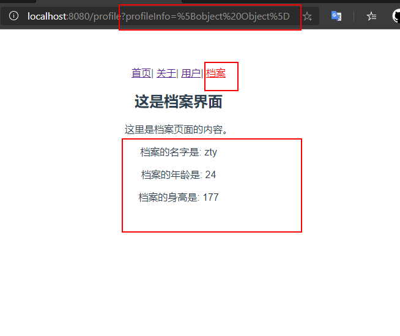

使用代码编写传递数据，使用`button`代替`<router-link>`，并添加点击事件。

```vue
<button @click="userClick">用户</button>
<button @click="profileClick">档案</button>
```

```js
    userClick() {
      this.$router.push('/user/' + this.userId)
      console.log("userClick")
    },
    profileClick() {
      let profileInfo = this.profileInfo
      this.$router.push({
        path: '/profile',
        query: {
          profileInfo
        }
      })
      console.log("profileClick")
    }
```

### 17.5.6 router 和 route 的由来

vue 全局对象`this.$router`与 main.js 导入的 router 对象是一个对象，也就是我们`router/index.js`导出的对象 router。

```js
new Vue({
	el: '#app',
	router, //使用路由对象
	render: (h) => h(App),
});
```

```js
//4.导出router实例
export default router;
```

`this.$route`对象是当前处于活跃的路由，有 params 和 query 属性可以用来传递参数。

查看`vue-router`源码,在我们项目中的`router/index.js`中，vue 对于插件必须要使用`Vue.use(Router)`，来安装插件，也就是执行 vue-router 的`install.js`。

在[vue-router 的 github](https://github.com/vuejs/vue-router/tree/dev/src)源码中查看 src 结构如下：

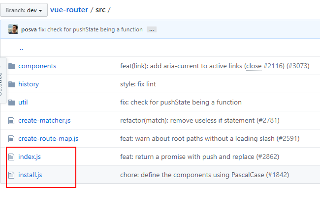

其中 index.js 是入口文件，入口 js 文件就是导入并执行了 install.js 文件。

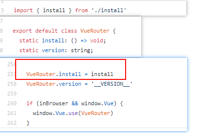

> 发现

install.js 中有注册 2 个全局组件`RouterView`和`RouterLink`，所以我们能使用`<router-view>`和`<router-link>`组件。

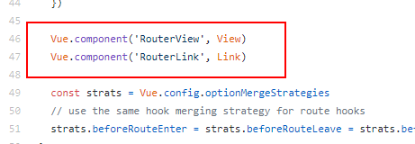

> $router和$route 是继承自 vue 的原型

怎么理解原型？学过 Java 的都知道有父类和子类，子类也可以有自己的子类，但是他们都有一个处于最顶层的类 Object(所有类的父类)。在 Vue 中就有那一个`Vue`类似 Object，在 java 中在 Object 中定义的方法，所有的类都可以使用可以重写，类似的`Vue.prototype`（Vue 的原型）定义的属性方法，他的原型链上的对象都可以使用，而`$router`和`$route`都在 Vue 的原型链上。

在 main.js 入口文件中在 vue 的原型上定义一个方法 test，然后在 User 组件中尝试调用。

```js
import Vue from 'vue';
import App from './App';
import router from './router';

//在vue的原型上添加test方法
Vue.prototype.test = function () {
	console.log('test');
};
Vue.config.productionTip = false;

/* eslint-disable no-new */
new Vue({
	el: '#app',
	router, //使用路由对象
	render: (h) => h(App),
});
```

```vue
<template>
	<div class="page-contianer">
		<h2>这是用户界面</h2>
		<p>这里是用户页面的内容。</p>
		<p>用户ID是: {{ userId }}</p>
		<button @click="btnClick">按钮</button>
	</div>
</template>

<script type="text/ecmascript-6">
export default {
  name: 'User',
  computed:{
    userId() {
      return this.$route.params.userId
    }
  },
  methods: {
    btnClick() {
      //所有组件都继承自vue的原型
      console.log(this.$router)
      console.log(this.$route)
      //调用vue原型的test
      this.test()
    }
  }
}
</script>

<style scoped></style>
```

启动项目点击 User 页面上的按钮，打开浏览器控制台查看日志发现 test 方法被执行了，而 User 组件中并未定义 test 方法，却可以调用。

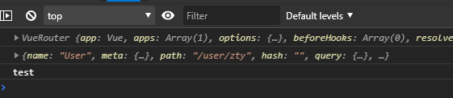

继续来读 install.js，install.js 中一开始就将`Vue`这个类当参数传入了 install 方法中，并把`Vue`赋值给`_Vue`。

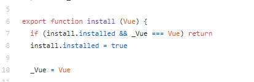

继续读 install.js 发现以下代码

```js
Object.defineProperty(Vue.prototype, '$router', {
	get() {
		return this._routerRoot._router;
	},
});
//Object.defineProperty用来定义属性
Object.defineProperty(Vue.prototype, '$route', {
	get() {
		return this._routerRoot._route;
	},
});
```

`Object.defineProperty`用来定义属性，以上代码就是给`Vue.prototype`(Vue 原型)添加`$router`和`$route`属性并给属性赋值，等价于

```js
Vue.prototype.$router = {
	get() {
		return this._routerRoot._router;
	},
};
Vue.prototype.$router = {
	get() {
		return this._routerRoot._router;
	},
};
```

也就是在 Vue 的原型上添加`$router`和`$route`属性,再查看 get()返回值`this._routerRoot._router`

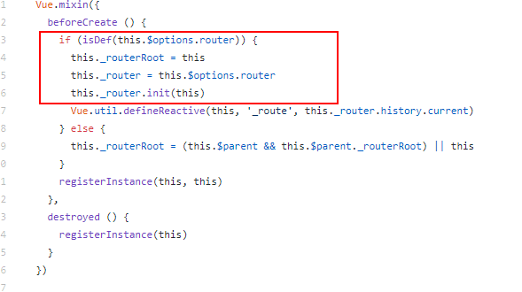

这里的`this.$options.router`就是我们 main.js 入口文件传入的参数`router`，也就是 router/index.js 导出的`router`对象。

```js
new Vue({
	el: '#app',
	router, //使用路由对象
	render: (h) => h(App),
});
```

## 17.6 vue-router 其他

### 17.6.1 vue-router 的导航守卫

问题：我们经常需要在路由跳转后，例如从用户页面跳转到首页，页面内容虽然可以自己定义，但是只有一个 html 文件，也只有一个 title 标签，我们需要改变标题。

可以使用 js 去修改 title，可以使用 vue 的生命周期函数在组件被创建的时候修改 title 标签内容。

```js
created() {
	//创建的时候修改title
    document.title = '关于'
}
mounted() {
    //数据被挂载到dom上的时候修改title
}
update() {
    //页面刷新的时候修改
}
```

当然不能每个组件去写生命周期函数，如果我们能监听路由的变化(了解路由从哪来往哪里跳转)，那我们就能在跳转中修改 title 标签，这就是导航守卫能做的事情。

修改`router/index.js`

```js
/**
 * 前置钩子：从from跳转到to
 * from 来的路由
 * to 要去的路由
 */
router.beforeEach((to, from, next) => {
	document.title = to.matched[0].meta.title; //给目标路由的页面的title赋值
	next(); //必须调用，不调用不会跳转
});
```

> router.beforeEach()称为前置钩子(前置守卫)，顾名思义，跳转之前做一些处理。

当然每个路由配置上也要加上 meta 属性，不然就取不到了，为什么要使用`matched[0]`，因为如果你是嵌套路由，有没有给子路由添加 meta（元数据：描述数据的数据）属性，就会显示`undefined`，使用`matched[0]`表示取到匹配的第一个就会找到父路由的 meta 属性。

```js
  //配置路由和组件之间的对应关系
  {
    path: '/home',//home  前端路由地址
    name: 'Home',
    component: Home, //组件名
    meta: {
      title: '首页'
    },
    children: [
      {
        path: '',
        redirect: '/home/news'//缺省时候重定向到/home/news
      },
      {
        path: 'news',//子嵌套路由 无须加/
        name: 'News',
        component: () => import('@/components/HomeNews') //懒加载组件
      },
      {
        path: 'message',
        name: 'Message',
        component: () => import('@/components/HomeMessage') //懒加载组件
      }
    ]
  },
```

启动服务发现功能已经实现。

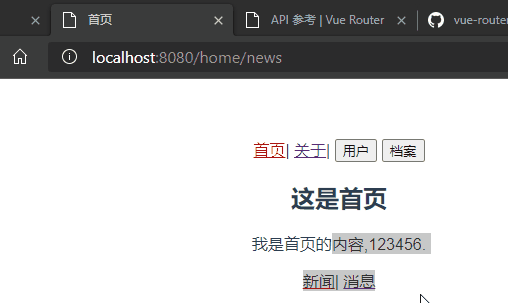

### 17.6.2 导航守卫补充

前面说了前置守卫 router.beforeEach()，相对的应该也存在后置守卫(后置钩子)。

```js
/**
 * 后置钩子
 */
router.afterEach((to, from) => {
	console.log('后置钩子调用了----');
});
```

顾名思义，也就是在跳转之后的回调函数。

-   前置守卫和后置守卫都是**全局守卫**。
-   还有[路由独享守卫](https://router.vuejs.org/zh/guide/advanced/navigation-guards.html#%E8%B7%AF%E7%94%B1%E7%8B%AC%E4%BA%AB%E7%9A%84%E5%AE%88%E5%8D%AB)
-   [组件内的守卫](https://router.vuejs.org/zh/guide/advanced/navigation-guards.html#%E7%BB%84%E4%BB%B6%E5%86%85%E7%9A%84%E5%AE%88%E5%8D%AB)

> 路由独享守卫，路由私有的

```js
  {
    path: '/about',//about 前端路由地址
    name: 'About',
    component: () => import('@/components/About'),
    beforeEnter: (to, from, next) => {
      console.log('来自' + from.path + ',要去' + to.path)
      next()
    },
    meta: {
      title: '关于'
    }
  },
```

`beforeEnter`的参数与全局守卫一样，修改`about`路由的参数，添加路由独享守卫，此时只有跳转到`about`路由，才会打印日志。

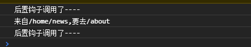

> 组件内的守卫，直接在组件中定义的属性

-   `beforeRouteEnter`
-   `beforeRouteUpdate` (2.2 新增)
-   `beforeRouteLeave`

```js
const Foo = {
	template: `...`,
	beforeRouteEnter(to, from, next) {
		// 在渲染该组件的对应路由被 confirm 前调用
		// 不！能！获取组件实例 `this`
		// 因为当守卫执行前，组件实例还没被创建
	},
	beforeRouteUpdate(to, from, next) {
		// 在当前路由改变，但是该组件被复用时调用
		// 举例来说，对于一个带有动态参数的路径 /foo/:id，在 /foo/1 和 /foo/2 之间跳转的时候，
		// 由于会渲染同样的 Foo 组件，因此组件实例会被复用。而这个钩子就会在这个情况下被调用。
		// 可以访问组件实例 `this`
	},
	beforeRouteLeave(to, from, next) {
		// 导航离开该组件的对应路由时调用
		// 可以访问组件实例 `this`
	},
};
```

`beforeRouteEnter` 守卫 **不能** 访问 `this`，因为守卫在导航确认前被调用,因此即将登场的新组件还没被创建。

不过，你可以通过传一个回调给 `next`来访问组件实例。在导航被确认的时候执行回调，并且把组件实例作为回调方法的参数。

```js
beforeRouteEnter (to, from, next) {
  next(vm => {
    // 通过 `vm` 访问组件实例
  })
}
```

注意 `beforeRouteEnter` 是支持给 `next` 传递回调的唯一守卫。对于 `beforeRouteUpdate` 和 `beforeRouteLeave` 来说，`this` 已经可用了，所以**不支持**传递回调，因为没有必要了。

```js
beforeRouteUpdate (to, from, next) {
  // just use `this`
  this.name = to.params.name
  next()
}
```

这个离开守卫通常用来禁止用户在还未保存修改前突然离开。该导航可以通过 `next(false)` 来取消。

```js
beforeRouteLeave (to, from , next) {
  const answer = window.confirm('Do you really want to leave? you have unsaved changes!')
  if (answer) {
    next()
  } else {
    next(false)
  }
}
```

### 17.6.3 完整的导航解析流程

1. 导航被触发。
2. 在失活的组件里调用离开守卫。
3. 调用全局的 `beforeEach` 守卫。
4. 在重用的组件里调用 `beforeRouteUpdate` 守卫 (2.2+)。
5. 在路由配置里调用 `beforeEnter`。
6. 解析异步路由组件。
7. 在被激活的组件里调用 `beforeRouteEnter`。
8. 调用全局的 `beforeResolve` 守卫 (2.5+)。
9. 导航被确认。
10. 调用全局的 `afterEach` 钩子。
11. 触发 DOM 更新。
12. 用创建好的实例调用 `beforeRouteEnter` 守卫中传给 `next` 的回调函数。

## 17.7 keep-alive

先给 Home 组件加上`created()`和`destoryed()`2 个生命周期函数。

```vue
<script type="text/ecmascript-6">
export default {
  name: 'Home',
  created() {
    console.log('Home组件被创建了')
  },
  destoryed() {
    console.log('Home组件被销毁了')
  }
}
</script>
```

启动项目，某些时候可能有这样的需求，如图所示：

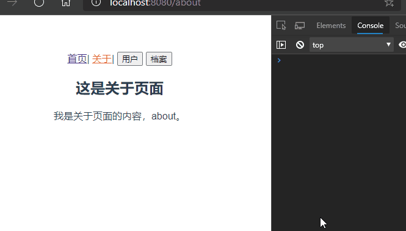

**分析**

在首页和关于组件之间路由跳转的时候，Home 组件一直重复创建和销毁的过程，每次创建都是新的 Home 组件，但是我有这样的需求。当我点击首页消息页面，随后跳转到关于页面，又跳转到首页，此时我希望显示的是首页的消息页面而不是默认的新闻页面，此时就需要`keep-alive`来使组件保持状态，缓存起来，离开路由后，Home 组件生命周期的`destroyed()`不会被调用，Home 组件不会被销毁。

-   `keep-alive`是 Vue 内置的一个组件，可以使被包含的组件保留状态，或者避免重新渲染。
-   `router-view`也是一个组件，如果用`<keep-alive><router-vie/></keep-alive>`，将其包起来，所有路径匹配到的视图组件都会被缓存。

**修改`app.vue`代码**

```html
<keep-alive>
	<router-view />
</keep-alive>
```

再次启动项目，发现还是新闻页面？难道是`keep-alive`无效？


仔细看控制台发现，在跳转关于页面的时候 Home 组件并没有被销毁，说明`keep-alive`生效了。仔细查看路由配置发现，`/home`被默认重定向到了`/home/news`。所以在访问`/home`的时候每次出来的都是新闻。

**思路**

-   将默认的重定向去掉，但是第一次进入首页，那新闻页面内容又不会显示了。

    ```js
    // {
    //   path: '',
    //   redirect: '/home/news'//缺省时候重定向到/home/news
    // },
    ```

-   为了第一次能使新闻页面内容显示，可以使用`created()`，将路由用代码的方式手动重定向，也就是 push。

    ```js
      created() {
        console.log('Home组件被创建了')
        this.$router.push('/home/news')
      },
    ```

-   由于`keep-alive`组件只创建一次，第一次进入 Home 组件的时候，新闻页面显示正常，当第二次跳转首页的时候，因为不会再调用`created()`，所以新闻页面又不会显示了。

-   为了解决问题，在 Home 组件中引入`activated()`和`deactivated()`两个函数，这 2 个函数与`keep-alive`有关，不使用`keep-alive`的这两个函数无效。

    -   `activated()`当组件属于进入活跃状态的时候调用
    -   `deactivated()`当组件属于退出活跃状态的时候调用(此时路由已经跳转，所以不能在此方法中修改路由，因为修改的是 to 路由)

-   为了使第二次进入首页新闻页面可以生效，使用`activated()`在 Home 组件使活跃状态时候就重定向

    ```js
        data() {
        return {
          path: '/home/news'
        }
      },
      activated(){
        console.log('调用actived')
        this.$router.push(this.path)//在活跃的时候将保存的路由给当前路由
      },
      deactivated(){
        console.log('调用actived')
        console.log(this.$route.path)
        this.path = this.$route.path//变成不活跃状态，将最后的路由保存起来
      }
    ```

-   发现还是不行，由于`deactivated()`调用的时候，此时路由已经跳转，所以不能在此方法中修改路由，因为修改的是 to 路由。

-   使用路由守卫(组件内守卫)，`beforeRouteLeave (to, from , next)`在离开路由的时候将当前的路由赋值给 path 并保存起来。

    ```js
      activated(){
        console.log('调用actived')
        this.$router.push(this.path)
      },
      // deactivated(){
      //   console.log('调用actived')
      //   console.log(this.$route.path)
      //   this.path = this.$route.path
      // },
      beforeRouterLeave(to, from, next) {
        console.log(this.$route.path)
        this.path = this.$route.path
        next()
      }
    ```

    此时问题完全解决了。

    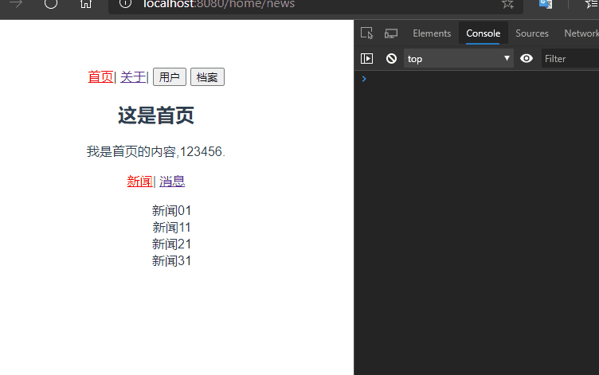

**keep-alive 的属性**

```vue
<keep-alive>
      <router-view/>
    </keep-alive>
```

我们将`<router-view/>`包起来，那所有的组件都会缓存，都只会创建一次，如果我们需要某一个组件每次都创建销毁，就需要使用`exclude`属性。

```vue
<keep-alive exclude="Profile,User">
   <router-view/>
</keep-alive>
```

此时`Profile`和`User`组件（这里组件需要有 name 属性，分别为`Profile`和`User`）就被排除在外，每次都会创建和销毁。相对应的也有`include`属性，顾名思义就是包含，只有选中的才有`keep-alive`。

```vue
<keep-alive include="Profile,User">
   <router-view/>
</keep-alive>
```

> `include`和`exclude`都是使用字符串和正则表达式，使用字符串的时候，注意“,”之后之前都别打空格。

## 17.8 综合练习-实现 Tab-Bar

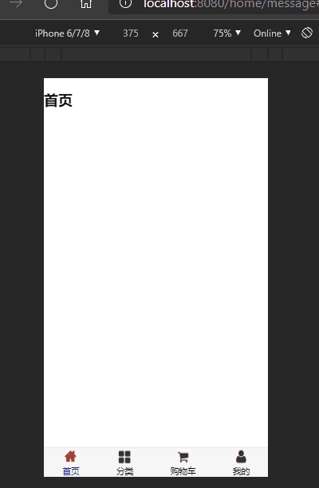

### 17.8.1 实现 Tab-Bar 思路

1. 下方单独的`Tab-Bar`组件如何封装？
    - 自定义`Tab-Bar`组件，在 APP 中使用
    - 让`Tab-Bar`位置在底部，并设置你需要的样式
2. `Tab-Bar`中显示的内容由外部决定
    - 定义插槽
    - flex 布局平分`Tab-Bar`
3. 自定义`Tab-Bar-Item`，可以传入图片和文字
    - 定义`Tab-Bar-Item`，并定义两个插槽：图片和文字
    - 给插槽外层包装`div`，设置样式
    - 填充插槽，实现底部`Tab-Bar`的效果
4. 传入高亮图片
    - 定义另一个插槽，插入`active-icon`的数据
    - 定义一个变量`isActicve`，通过`v-show`来决定是否显示对应的 icon
5. `Tab-Bar-Item`绑定路由数据
    - 安装路由：`npm install vue-router --save`
    - 在`router/index.js`配置路由信息，并创建对应的组件
    - `main.js`中注册`router`
    - `App.vue`中使用`router-link`和`router-view`
6. 点击 item 跳转到对应的路由，并且动态决定`isActive`
    - 监听`item`的点击，通过`this.$router.replace()`替换路由路径
    - 通过`this.$route.path.indexOf(this.link)!==-1`来判断是否使`active`
7. 动态计算 active 样式
    - 封装新的计算属性：`this.isActive?{'color': 'red'}:{}`

### 17.8.2 代码实现

使用`vue init webpack 02-vue-router-tabbar-v1`新建一个项目工程(使用`vuecli2`)。

1. 在文件夹 assest 下新建 css/base.css,用于初始化 css

    > base.css

    ```css
    body {
    	padding: 0;
    	margin: 0;
    }
    ```

    > 修改 App.vue，添加初步样式

    ```vue
    <template>
    	<div id="app">
    		<div id="tar-bar">
    			<div class="tar-bar-item">首页</div>
    			<div class="tar-bar-item">分类</div>
    			<div class="tar-bar-item">购物车</div>
    			<div class="tar-bar-item">我的</div>
    		</div>
    	</div>
    </template>

    <script>
    export default {
    	name: 'App',
    };
    </script>

    <style>
    /* style中引用使用@import */
    @import url('./assets/css/base.css');

    #tar-bar {
    	display: flex;
    	background-color: #f6f6f6;

    	position: fixed;
    	left: 0;
    	right: 0;
    	bottom: 0;

    	box-shadow: 0 -1px 1px rgba(100, 100, 100, 0.2);
    }

    .tar-bar-item {
    	flex: auto;
    	text-align: center;
    	height: 49px;
    	font-size: 20px;
    }
    </style>
    ```

    > 使用 npm run dev，查看网页效果

    

    > 思考：如果每次都要复用 tabbar，那每次都需要复制粘贴，应该要把 tabbar 抽离出来，vue 就是组件化思想。

2. 将 tabbar 抽离成组件

    在 components 下新建 tabbar 文件夹，新建`TarBar.vue`和`TabBarItem.vue`,`TabBarItem`组件是在组件`TarBar`中抽取出来的，可以传入图片和文字（比如首页），所有需要使用插槽`<slot>`代替。

    > TarBar.vue

    ```vue
    <template>
    	<div id="tab-bar">
    		<!-- 插槽代替tabbaritem -->
    		<slot></slot>
    	</div>
    </template>
    <script type="text/ecmascript-6">
    export default {
      name: 'TabBar'
    }
    </script>
    <style scoped>
    #tab-bar {
    	display: flex;
    	background-color: #f6f6f6;

    	position: fixed;
    	left: 0;
    	right: 0;
    	bottom: 0;

    	box-shadow: 0 -1px 1px rgba(100, 100, 100, 0.2);
    }
    </style>
    ```

TabBar 弄一个 slot 插槽用于插入 TabBarItem 组件（可能插入多个）.

> TabBarItem.vue

```vue
<template>
	<div class="tab-bar-item">
		<!-- item-icon表示图片插槽 item-text表示文字插槽，例如首页 -->
		<slot name="item-icon"></slot>
		<slot name="item-text"></slot>
	</div>
</template>
<script type="text/ecmascript-6">
export default {
  name: 'TabBarItem'
}
</script>
<style scoped>
.tab-bar-item {
	flex: auto;
	text-align: center;
	height: 49px;
	font-size: 14px;
}
.tab-bar-item img {
	height: 24px;
	width: 24px;
	margin-top: 3px;
	vertical-align: middle;
	margin-bottom: 2px;
}
</style>
```

TabBarItem 组件中插入 2 个插槽一个用于插入图片一个用于插入文字。

> MainTabBar.vue

```vue
<template>
	<div class="main-tab-bar">
		<TabBar>
			<TabBarItem path="/home" activeColor="blue">
				
				<template v-slot:item-text>
					<div>首页</div>
				</template>
			</TabBarItem>
			<TabBarItem path="/categories">
				<template #item-icon>
					
				</template>
				<template #item-text>
					<div>分类</div>
				</template>
			</TabBarItem>
			<TabBarItem path="/shop">
				<template #item-icon>
					
				</template>
				<template #item-text>
					<div>购物车</div>
				</template>
			</TabBarItem>
			<TabBarItem path="/me">
				<template #item-icon>
					
				</template>
				<template #item-text>
					<div>我的</div>
				</template>
			</TabBarItem>
		</TabBar>
	</div>
</template>
<script type="text/ecmascript-6">
import TabBar from "@/components/tabbar/TabBar"
import TabBarItem from "@/components/tabbar/TabBarItem"
export default {
  name: "MainTabBar",
  components: {
    TabBar,
    TabBarItem
  }
}
</script>
<style scoped></style>
```

在 MainTabBar 组件中加入另外 2 个组件。

> 注意此处使用`~assets`和`@/components`是使用了别名配置，[详情请看 17.8.3 别名配置](#17.8.3 别名配置)

最后在 app.vue 中导入 MainTabBar 组件。

```vue
<template>
	<div id="app">
		<MainTabBar></MainTabBar>
	</div>
</template>
<script>
import MainTabBar from '@/components/MainTabBar';
export default {
	name: 'App',
	components: {
		MainTabBar,
	},
};
</script>
<style>
/* style中引用使用@import */
@import url('./assets/css/base.css');
</style>
```

效果如图所示，将组件进行了分离重组，只要修改 MainTabBar 组件就可以修改图片和文字描述，可以复用。


3. 如何实现点击首页首页字体变红图片变红色

    这里需要用到路由的`active-class`。

    > 思路：引用 2 张图片，一张是正常颜色一张是红色，使用`v-if`和`v-else`来处理是否变色，在路由处于活跃状态的时候，变红色。

    引入路由使用路由就不细说了，这里仅贴上 tabbar 的修改代码。

    > TabBarItem.vue 组件

    ```vue
    <template>
    	<div class="tab-bar-item" :style="activeStyle" @click="itemClick">
    		<!-- item-icon表示图片插槽 item-text表示文字插槽，例如首页 -->
    		<div v-if="!isActive">
    			<slot name="item-icon"></slot>
    		</div>
    		<div v-else>
    			<slot name="item-icon-active"></slot>
    		</div>
    		<div :class="{ active: isActive }">
    			<slot name="item-text"></slot>
    		</div>
    	</div>
    </template>

    <script type="text/ecmascript-6">
    export default {
      name: 'TabBarItem',
      props:{
        path:String,
        activeColor:{
          type:String,
          default:'red'
        }
      },
      computed: {
        isActive(){
          return this.$route.path.indexOf(this.path) !== -1
        },
        activeStyle(){
          return this.isActive ? {color: this.activeColor} : {}
        }
      },
      methods: {
        itemClick(){
          this.$router.push(this.path)
        }
      }
    }
    </script>

    <style scoped>
    .tab-bar-item {
    	flex: auto;
    	text-align: center;
    	height: 49px;
    	font-size: 14px;
    }

    .tab-bar-item img {
    	height: 24px;
    	width: 24px;
    	margin-top: 3px;
    	vertical-align: middle;
    	margin-bottom: 2px;
    }
    </style>
    ```

    1. 使用`props`获取传递的值，这里传递是激活颜色，默认是红色
    2. 设置计算属性`isActive`和`activeStyle`，分别表示激活状态和激活的样式
    3. 定义`itemClick()`方法用于获取点击事件，点击后使用代码实现路由跳转，这里使用默认的 hash 模式
    4. 使用`v-if`和`v-else`来进行条件判断

    > MainTabBar.vue 组件

    ```vue
    <TabBarItem path="/home">
            
            
            <template v-slot:item-text>
              <div>首页</div>
            </template>
          </TabBarItem>
    ```

    添加激活状态的图片与未激活的图片并列。

4. 配置路由信息，参考之前的代码

    ```js
    import Vue from 'vue';
    import Router from 'vue-router';

    Vue.use(Router);

    const routes = [
    	{
    		path: '/',
    		redirect: '/home', //缺省时候重定向到/home
    	},
    	{
    		path: '/home',
    		component: () => import('../views/home/Home.vue'),
    	},
    	{
    		path: '/categories',
    		component: () => import('../views/categories/Categories.vue'),
    	},
    	{
    		path: '/shop',
    		component: () => import('../views/shop/Shop.vue'),
    	},
    	{
    		path: '/profile',
    		component: () => import('../views/profile/Profile.vue'),
    	},
    ];

    export default new Router({
    	routes,
    	// linkActiveClass:"active"
    });
    ```

    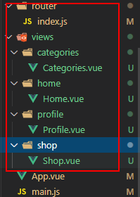

5. 修改 main.js 和 App.vue

    ```js
    import Vue from 'vue';
    import App from './App';
    import router from './router';

    Vue.config.productionTip = false;

    /* eslint-disable no-new */
    new Vue({
    	el: '#app',
    	router,
    	render: (h) => h(App),
    });
    ```

    ```vue
    <template>
    	<div id="app">
    		<router-view></router-view>
    		<MainTabBar></MainTabBar>
    	</div>
    </template>

    <script>
    import MainTabBar from '@/components/MainTabBar';
    export default {
    	name: 'App',
    	components: {
    		MainTabBar,
    	},
    };
    </script>

    <style>
    /* style中引用使用@import */
    @import url('./assets/css/base.css');
    </style>
    ```

### 17.8.3 别名配置

经常的我们向引入图片文件等资源的时候使用相对路径，诸如`../assets/xxx`这样的使用`../`获取上一层，如果有多个上层就需要`../../xxx`等等这样不利于维护代码。此时就需要一个能获取到指定目录的资源的就好了。

> 配置

在`webpack.base.config`中配置使用别名，找到 resolve:{}模块，增加配置信息

```js
  resolve: {
    extensions: ['.js', '.vue', '.json'],
    alias: {
      '@': resolve('src'),
      'assets': resolve('src/assets'),
      'components': resolve('src/components'),
      'views': resolve('scr/views')
    }
  },
```

这里`@`指定目录是`src`，例如`@/components`表示`src/components`目录，`assets`表示`src/assets`前缀，如果是`assets/img`就表示`src/assets/img`目录。
